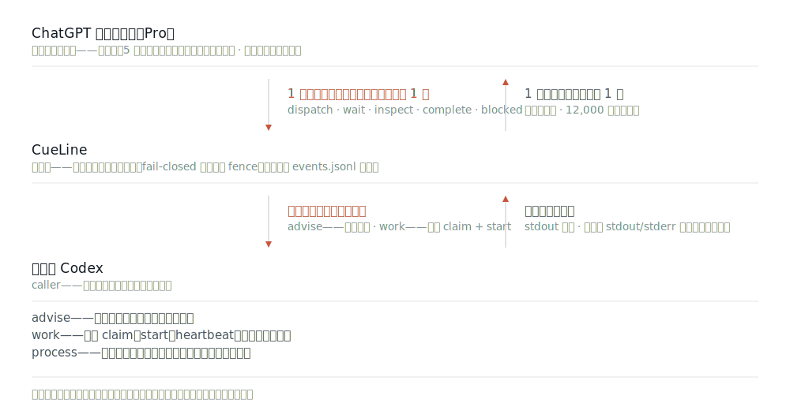
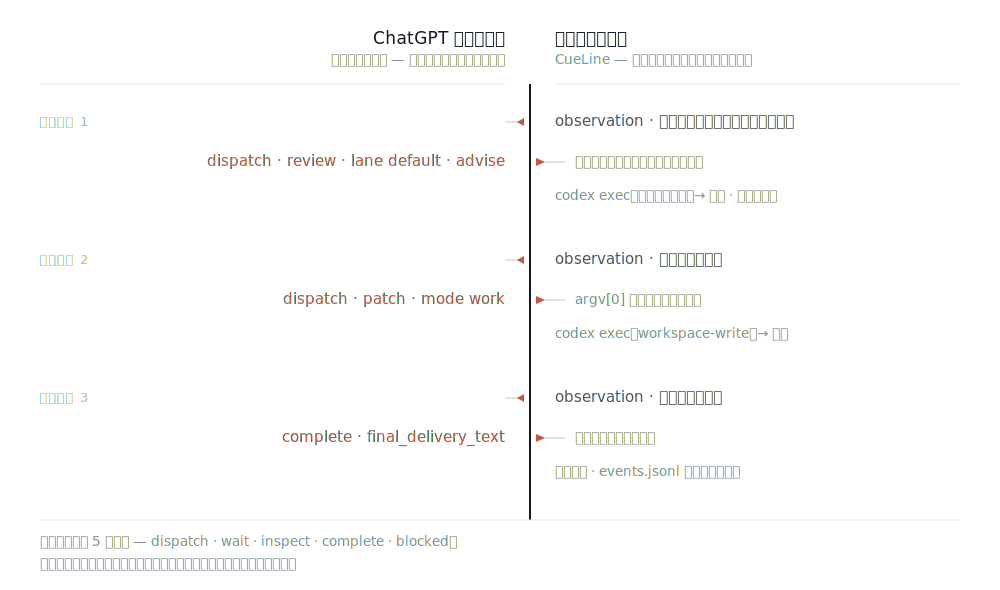
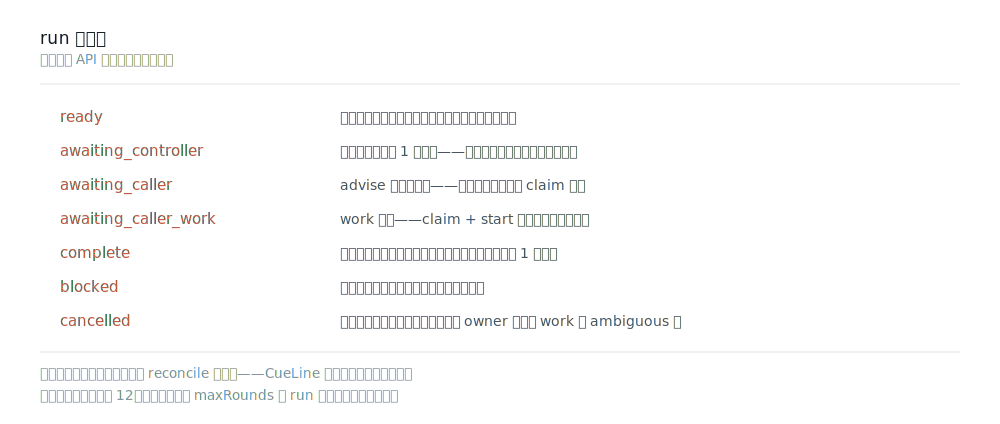

<picture>
  <source media="(prefers-color-scheme: dark)" srcset="docs/assets/cueline-banner-dark.svg">
  
</picture>

<p align="center">
  <a href="https://github.com/Seraphim0916/cueline/actions/workflows/ci.yml"></a>
  <a href="https://www.npmjs.com/package/cueline"></a>
  <a href="package.json"></a>
  <a href="LICENSE"></a>
</p>

<p align="center">
  <a href="README.md">English</a> · <a href="README.zh-TW.md">繁體中文</a> · <a href="README.zh-CN.md">简体中文</a> · <b>日本語</b> · <a href="README.ko.md">한국어</a>
</p>

**CueLine は、開いている ChatGPT のウェブ会話に判断を任せます。会話側はテキストコマンドを出し、CueLine が検証し、現在の Codex が許可されたローカル作業を実行します。**

ウェブページはあなたのマシンに触れず、ローカルツールもありません。1 ラウンドに出すのはテキストコマンド 1 つだけです。既定の `caller` 実行では、`advise` は協調用の引き渡し、`work` は永続 claim と start が必要です。登録済みワーカーを起動する process executor には二重の明示的承認が必要です。



CueLine は独立した実装で、**ランタイムの npm 依存はゼロ**です。Omnilane のラッパーではありません。

## 最新リリース：0.6.1

- ChatGPT の履歴メッセージ数を読めない場合、送信処理はクリック前に fail-closed となり、正確なクリック対象を永続記録し、1 回の試行につき Send は 1 回だけ許可します。永続的な one-shot recovery は同じ round と request identity を再利用します。永続的な submitted 証拠がある場合、完全一致する Pro 応答は古い not-sent 証拠より優先され、重複送信や新しい round を作らずに受理されます。715/715 テストに合格しました。

詳細は [changelog](CHANGELOG.md#061---2026-07-22) またはバージョン指定の [v0.6.1 release](https://github.com/Seraphim0916/cueline/releases/tag/v0.6.1) を参照してください。

## 1 回の実行は実際にどう進むか



各ラウンドで CueLine は観測を送り、後で `<CueLineControl>` エンベロープを**ちょうど 1 つだけ**読み戻します。コントローラーは `dispatch`、`wait`、`inspect`、`complete`、`blocked` のいずれかを選びます。ループは 1 回の永続的な送信後に `awaiting_controller` で一時停止し、caller への引き渡し、`complete`、`blocked`、またはラウンド上限（既定 12 回）でも停止します。

コントローラーコマンドには fail-closed なリソース上限もあります：エンベロープあたり 131,072 文字、dispatch あたり最大 64 ジョブ、wait / inspect あたり最大 256 個の明示 job ID。これらの検査はジョブ登録やプロセス起動の前に行われます。

既定値以外の `maxRounds` は run 作成時に固定され、owner 不在の一時停止をまたいでコントローラーの総ラウンド数を数えます。後の続行では通常省略して永続値を再利用し、異なる値を渡すと予算を暗黙にリセットまたは拡張せず拒否します。

`startCueLineRun` と `runCueLine` の既定は `caller` です。送信後は `awaiting_controller` を返して lease を解放し、続行は 1 回の読み取り専用観測だけを行い、再送しません。`advise` は `awaiting_caller`、`work` は `awaiting_caller_work` を返します。work は現在の Codex が `claimCueLineCallerJob` と `startCueLineCallerJob` を成功させるまで開始されません。claim は run、job、task hash、絶対 workdir、caller identity、fencing token に結び付けられ、開始済み work は自動再試行されず、期限切れなら `ambiguous` になります。Pro はテキスト命令を提案・審査するだけで、ローカルツールは使いません。

Process モードは `executor: "process"` と `allowProcessExecution: true` の両方が必要で、非終端の続行でも第 2 の承認を再度渡します。組み込み route はさらに `--ignore-user-config` を使い、隠れた worker がユーザー設定の MCP server やそのコマンド引数を読み込まないようにします。レーンと候補は起動前に検証され、シェルも起動後の自動フォールバックも使いません。

コントローラープロトコルでは、ルーティングの階層を明確に区別します。`lane` に指定するのはレーン名の `default` であり、`codex-default` はそのレーン内の候補ランナーであって、レーンではありません。CueLine はジョブを一つでも登録する前に `dispatch` 全体を検証します。無効なレーンまたはランナーが一つでもあれば、途中まで実行せず、`dispatch` 全体を修正のために差し戻します。

これは許可リスト（allow-list）であって、サンドボックスではありません。登録されたワーカーは CueLine プロセス自身と同じ権限で動きます。`advise` は Codex の読み取り専用サンドボックスに、`work` は `workspace-write` に対応しますが、登録したものが、そのまま許可したものになります。

## run の状態



`cueline run status <run-id> --json` は永続状態と `safeNextAction` を報告し、`cueline run doctor <run-id> --json` は同じスナップショットを安定した finding コードと安全な次の一手に変換します。曖昧なもの——送信されたかもしれないクリック、期限切れの開始済み claim、手動の添付送信——に対して、CueLine は再送せず停止し、明示的な reconcile を求めます。復旧の完全な契約は [state and recovery](docs/state-and-recovery.md) を参照してください。

## コントローラーは Pro モデルでなければならない

コンポーザーのモデルセレクターが `Pro` を示していないかぎり、CueLine は送信を拒否します。会話が別のモデルにある場合、CueLine はまずコンポーザーを `Pro` に切り替えます——それが唯一許されたモデル切り替えです。検証済みのライブ実行では、Instant を Pro に切り替え、応答は `gpt-5-6-pro` として返りました。

選ぶことと、証明することは違います。各応答のあと CueLine は、完了したアシスタントメッセージのモデル slug を読み、それが Pro の slug であることを要求します。送信から返信までのあいだに格下げが起きても、信用せずに検出します。失敗は `MODEL_SELECTOR_MISSING`、`PRO_MODEL_UNAVAILABLE`、`PRO_MODEL_SELECTION_FAILED`、`PRO_MODEL_MISMATCH` として表面化し、受理された回答になることは決してありません。

ChatGPT Pro のサブスクリプションと、選択された Pro モデルは別物です。アカウントやプロフィールのラベルに `Pro` が含まれていても、それはサブスクリプションの証拠にすぎず、モデルの証拠には決してなりません。モデルの証拠になるのは応答のモデル slug だけです。ライブのターンごとに `controller_response_received` が `selected_model_label`、`response_model_slug`、`model_evidence_source` とともに永続化されるため、どちらの証拠がモデルを裏づけたのかは後からでも監査できます。

## クイックスタート

必要なもの：Node.js 22 以上、組み込みブラウザーを備えた Codex、そして——同梱の既定レーンを使う場合は——`PATH` 上の `codex` CLI。

npm レジストリからインストールします。

```bash
npm install -g cueline@0.6.1
cueline install
cueline doctor
```

フォールバックとして、[v0.6.1 リリース](https://github.com/Seraphim0916/cueline/releases/tag/v0.6.1) のパッケージ済み tarball をインストールすることもできます。同じリリースに `.sha256` チェックサムも置いてあります。

```bash
npm install -g https://github.com/Seraphim0916/cueline/releases/download/v0.6.1/cueline-0.6.1.tgz
cueline install
cueline doctor
```

`cueline install` が作るシンボリックリンクは 1 つだけ、同梱スキルを `$CODEX_HOME/skills/cueline`（既定では `~/.codex/skills/cueline`）に張ります。自分が所有していないパスの置き換えは拒否し、二度実行しても何も変わりません。`cueline uninstall` はそのリンクだけを外します。そこに他人のファイルがあれば、削除せず保持します。

### ソースからインストールする

```bash
git clone https://github.com/Seraphim0916/cueline.git
cd cueline
npm ci
npm run build
./install.sh      # ~/.codex/skills/cueline と ~/.local/bin/cueline のシンボリックリンクを作成
cueline doctor
```

`install.sh` が作るのはこの 2 つのシンボリックリンクだけです。自分が所有していないパスの上書きは拒否し、`./install.sh --uninstall` も自分が作ったリンクだけを削除します。

次に、Codex で：

1. Codex の組み込みブラウザーで `https://chatgpt.com` を開き、サインインします。
2. 主導させたい会話を選択したままにします。そのページがコントローラーです。選択中のタブがなく、一致する ChatGPT タブが複数ある場合、CueLine は先頭を勝手に選ばず `IAB_CHATGPT_TAB_AMBIGUOUS` を返します。そのコンポーザーは `Pro` モデルでなければなりません。そうでない場合、CueLine が `Pro` を選び、選べなければ送信を拒否します。
3. Codex にこう頼みます：*「CueLine を使って、開いている ChatGPT Pro の会話にこのタスクを指揮させて。」*
4. 返ってきた `runId` を控えておきます。中断した実行を再開する手がかりになります。

同梱の `cueline` スキルは、Codex 自身の Node ランタイムからこのパッケージを駆動します。組み込みブラウザーのオブジェクトはそこに存在するためです。別に起動したプレーンな `node` プロセスはそれを継承しません。

## コードから駆動する

```js
import {
  claimCueLineCallerJob,
  continueCueLineRun,
  createCodexIabAdapter,
  heartbeatCueLineCallerJob,
  runCueLine,
  startCueLineCallerJob,
  submitCueLineCallerJobResult,
} from "cueline";

let result = await runCueLine({
  request: "Inspect the repository, delegate an implementation plan, and report the evidence.",
  browser: createCodexIabAdapter({ browser: globalThis.browser }),
  // opt-in：archiveControllerConversationOnComplete: true,
  // 任意：conversationUrl、routingConfig / routingConfigPath、home、cwd、
  // runTimeoutMs、signal、ジョブごと／既定の期限。
}); // 既定は executor: "caller"

while (["awaiting_controller", "awaiting_caller", "awaiting_caller_work"].includes(result.status)) {
  if (result.status === "awaiting_controller") {
    await waitBeforeNextObservation(); // 有界バックオフ。再送しない
  } else if (result.status === "awaiting_caller") {
    for (const job of result.pendingJobs ?? []) {
      const stdout = await executeExactLocalAdvice(job.spec.task);
      await submitCueLineCallerJobResult(result.runId, job.jobId, {
        status: "succeeded",
        stdout,
      });
    }
  } else {
    for (const job of result.pendingJobs ?? []) {
      if (job.spec.mode !== "work") continue;
      const claim = await claimCueLineCallerJob(result.runId, job.jobId, { callerId: "stable-codex-task-identity" });
      const proof = { claimId: claim.claimId, callerId: claim.callerId, fencingToken: claim.fencingToken };
      await startCueLineCallerJob(result.runId, job.jobId, proof);
      const stdout = await executeExactLocalWork(job.spec.task, claim.resolvedWorkdir, {
        heartbeat: () => heartbeatCueLineCallerJob(result.runId, job.jobId, proof),
      });
      await submitCueLineCallerJobResult(result.runId, job.jobId, { status: "succeeded", stdout }, { claim: proof });
    }
  }
  result = await continueCueLineRun({ runId: result.runId });
}

if (result.status === "complete") {
  console.log(result.finalDeliveryText);
}
```

`archiveControllerConversationOnComplete` の既定は `false` で、run 作成時に固定されます。有効にすると、CueLine はまず `complete` を永続化し、その後 Pro がアイドルのあいだに、正確に結び付けられた会話だけをアーカイブします。永続クリックのチェックポイント前に証明された失敗は再試行できますが、その後のタイムアウト、再起動、遷移レース、証拠欠落はすべて `ambiguous` となり、CueLine が Archive を再クリックすることは二度とありません。`blocked` と `cancelled` の run は開いたまま残します。

`awaiting_controller` は再送なしの読み取り専用観測、`awaiting_caller` は advise の引き渡し、`awaiting_caller_work` は claim、start、実行、heartbeat、claim proof 付き提出の順です。Pro はローカルツールを直接使いません。

`listCueLineRuns()` は永続化された run ID を見つけるための、読み取り専用でサニタイズ済みの一覧です。コントローラー本文、会話 URL、job のタスク、worker 出力は含まれません。

`verifyCueLineRun(runId)` は作成 marker、イベント replay と authority fence、任意の snapshot、runtime lease、job status 証拠を対象とする読み取り専用の整合性検査です。永続 run の内容は返さず、安定した finding だけを返します。

`confirmManualControllerSubmission(runId, …)` と `confirmControllerTurnNotSent(runId, …)` は、2 種類の reconcile 確認のプログラム用インターフェースです。どちらも追記のみで冪等であり、ブラウザーを駆動することも、何かを再送することもありません。

Codex のランタイムでは、`cueline api path` が出力する絶対パスのモジュールを import します。それがインストールしたパッケージのビルド済み API です。

`startCueLineRun` は永続 run を作成して `ready` を返すだけです。`runCueLine` は作成後、永続 controller 観測待ち、caller 引き渡し、または終端まで進めます。owner 不在の `controller_response_pending` で通常送信済みターンが一つだけあり、`safeNextAction: observe` が示される場合、同じ Pro 応答を読み取り専用で観測する待機です。少し待って続行し、再送しません。`safeNextAction: reconcile` は曖昧、手動送信、または複数の保留ターンに使います。owner 不在の `caller_jobs_pending` は正常なローカル引き渡しであり、orphan や ChatGPT 待ちではありません。CLI の `run status` は引き渡しに必要な metadata だけを出力し、task 本文、caller identity、task hash、workdir、runtime owner ID を含めません。正式な claim 後にだけ、API が正確な task と workdir を認可された caller に返します。

## CLI

CLI はブラウザーを駆動しません。状態を書き込むコマンドの前に `cueline help` で完全な引数を確認してください。

| グループ | コマンド | 効果 |
| --- | --- | --- |
| 参照 | `doctor` · `routing` · `routing explain` · `jobs` · `runs` · `run status` · `run status-at` · `run diff` · `run doctor` · `run watch` · `run timeline` · `run graph` · `run verify` · `run handoff` · `protocol lint` · `api path` · `config path` | 読み取り専用 |
| インストール | `install` · `uninstall` | パッケージ所有のスキルリンクだけを作成・削除 |
| 復旧 | `run reconcile` · `run takeover` · `run reconcile-runtime` · `run cancel` / `run stop` · `job cancel` | 監査証拠の追記、または永続 run/job 状態の変更 |

```console
$ cueline doctor
CueLine 0.6.1
status	ok
node	22.14.0	ok
config	/usr/local/lib/node_modules/cueline/config/routing.default.json	valid
home	/Users/you/.cueline
caller_ready	yes
caller_lanes	1
process_available_lanes	1

$ cueline routing
default	codex-default	available

$ cueline run status run_... --json
{"status":"running","executor":"caller","phase":"caller_jobs_pending","runtime":{"ownership":"missing"},...}

$ cueline run doctor run_... --json
{"outcome":"action_required","phase":"caller_jobs_pending","nextAction":"execute_caller_jobs",...}

$ cueline run reconcile run_... --request-id msg_... --manual-send-confirmed --conversation-url https://chatgpt.com/c/...
run_...\tmsg_...\tconfirmed

$ cueline run cancel run_...
run_...	requested	affected_jobs=0
```

Node が古すぎる場合、または有効な caller レーンが一つもない場合、`cueline doctor` は非ゼロで終了します。`process_available_lanes` が 0 でも caller モードは劣化しません。process executor を明示的に選ぶ前だけ `cueline routing` で process の可用性を確認してください。`cueline api path` が出すのはスキルが import するモジュールなので、パッケージ導入ならリポジトリの取得は不要です。`cueline help` は `--json` と手動 reconcile の必須確認フラグを含む各コマンドの正確な構文を一覧します。

0.2.0 で追加された 4 つの可観測性コマンドは、すべて厳密に読み取り専用です。`run status-at` は単一の正確なイベント連番の時点にサニタイズ済み run 状態を再構築します——「その瞬間に CueLine が知っていたこと」です。`run diff` は 2 つのサニタイズ済み run サマリーをフィールド単位で比較し、生のプロンプトや出力は決して含めません。`run graph` はサニタイズ済み timeline エントリから有界の Mermaid 制御フロー図を描画します。`routing explain` はプロセス起動前に、レーン選択・可用性・却下理由を runner の引数を漏らさずに説明します（[multi-model routing](docs/multi-model-routing.md) を参照）。

実験的な診断コマンドには、それぞれ専用のドキュメントがあります：

| コマンド | 役割 | ドキュメント |
| --- | --- | --- |
| `run doctor` | run スナップショットを安定した finding コード、有界な証拠、安全な次の一手に変換（状態は書き込まない） | [run-doctor](docs/experiments/run-doctor.md) |
| `run watch` | 永続イベント連番をカーソルにした、有界で lease を取らない観測 | [run-watch](docs/experiments/run-watch.md) |
| `protocol lint` | Pro エンベロープをオフラインで検証し、既知の契約修正を一括報告 | [protocol-lint](docs/experiments/protocol-lint.md) |
| `run handoff` | 正確な identity と絶対パスを備えた安全な再開パケットを生成 | [run-handoff](docs/experiments/run-handoff.md) |
| `run timeline` | 生イベントを含まない、サニタイズ済みカーソルページングの監査ビュー | [run-timeline](docs/experiments/run-timeline.md) |

`run takeover` は `run status` が exact stale owner を示す場合だけ使います。新しい active heartbeat は拒否されます。返された `next: continue` または `next: reconcile_runtime` に従い、推測で進めないでください。

## 設定

`CUELINE_CONFIG` はルーティング設定ファイルを選び、`CUELINE_HOME` はローカル状態の置き場所を移します（既定は `~/.cueline`）。

Caller はプロセスを起動しません。`executor: "process"` と `allowProcessExecution: true` を同時に指定した場合だけ、`default` レーンの `codex-default` が隔離された `codex exec --ignore-user-config` を実行します。独立した `advise` の既定同時実行数は全体／レーンごとに 2、`work` を含むバッチは直列です。別の process worker を登録するには、[`config/routing.default.json`](config/routing.default.json) をコピーして候補を追加し、`CUELINE_CONFIG` をそこへ向けます。

モデル別の複数候補の登録方法と advise 専用ラッパーの例は、[multi-model routing](docs/multi-model-routing.md) を参照してください。

状態は `CUELINE_HOME` の下に置かれます：

```text
runs/<run-id>/events.jsonl + events.jsonl.segments/   追記のみ、正本
runs/<run-id>/runtime.json.fence + runtime.json.epochs/   世代分離されたライブ owner heartbeat 証拠
runs/<run-id>/runtime.json.retired-owners/   不変の旧 owner イベント cutoff
runs/<run-id>/runtime.json.takeover-intents/   不変の exact takeover 試行記録
runs/<run-id>/cancel.json    存在する場合は永続キャンセル要求
runs/<run-id>/snapshot.json   リプレイの最適化、破棄可能
jobs/<job-id>.json            ジョブごとの実行証拠
```

記録そのものはイベントログです。コントローラーのターンは送信する前に書かれ、ジョブはプロセスが起動する前に登録されます。だからこそ、意図と副作用のあいだで中断が起きても痕跡が残ります。壊れたスナップショットは信用されず、無視されてイベント 1 番から再構築されます。

復帰は完全に同じ会話 URL にだけ接続します。ChatGPT が長文を添付に自動変換した場合は `attachment_ready` として認識し、送信クリックは最大 1 回です。曖昧なクリックは `possibly_sent` となり再送しません。実際に見えて有効かつ操作可能な Stop コントロールがあるあいだだけ、応答は進行中とみなされます。隠れた残存ボタンが完了済みの Pro 応答を抑え込むことはありません。手動送信後は `cueline run reconcile RUN_ID --request-id REQUEST_ID --manual-send-confirmed` で正式に確認し、同一 conversation、Pro 証拠、protocol/run/round/request identity をすべて検証します。

逆方向の確認は「クリックが確実に届かなかった」場合のためのものです。操作者がその正確な会話を直接確認し、メッセージが存在しないことを確かめたうえで、`cueline run reconcile ... --not-sent-confirmed --conversation-url URL` を実行すると、旧 request identity を追記のみで放棄し、新しい決定的 request ID によるちょうど 1 回の同一プロンプト再試行を承認します。2 つのフラグは相互排他です。放棄したメッセージまたはその応答が後から現れた場合、CueLine は run を凍結して人手のレビューに回し、受理も再送も決して行いません。

Pro が回答しているあいだは、決して中断せず、`Answer now`、`Respond now`、`Stop` などの加速コントロールも使わないでください。Pro にはローカルツールがなく、リポジトリ構成やローカルパスの既定知識もありません。Caller の証拠には正確なコード／エラー識別子、関連コードの抜粋、絶対ローカルパスを含め、さらにローカル証拠が必要か Pro に明示的に尋ねてください。

コントローラー証拠は成功時の非空 stdout を優先し、全体 12,000 文字に制限します。完全な stdout/stderr はローカルに保持します。Pro が `inspect(job_ids)` を受理した場合、次のターンでは指定 job の証拠予算を先に確保してから無関係な証拠を扱います。

## 検証

```bash
npm ci
npm run typecheck
npm test
npm run smoke:fake
bash test/shell/install.test.sh
npm pack --dry-run
```

`npm run smoke:fake` は、偽のブラウザーと偽の runner を相手に、コントローラーループ全体をオフラインで走らせます。証明できるのはループであって、ライブのページではありません。後者を証明できるのは、組み込みブラウザーを通じて実際に完了した 1 ラウンドだけです。

## 0.1 の制限

テキストコマンドのみ。1 回の run につき会話は 1 つです。`Pro` の選択が CueLine が行う唯一のモデル切り替えです。長文の自動添付変換は対応しますが、意図的なファイルアップロード、画像、Deep Research、Projects、Apps は非対応です。Caller work は明示的な claim/start と、長時間作業では heartbeat が必要です。process 実行は二重承認が必要です。曖昧な送信や開始済みジョブを自動再試行しません。macOS が主要デスクトップターゲット、Linux が CI ターゲットで、Windows は未検証です。アダプターは現行の ChatGPT ウェブ UI に依存するため、UI 変更は捏造された回答ではなく明示的なエラーとして表面化します。

完全な対応表は [compatibility](docs/compatibility.md) を参照してください。

## ドキュメント

| ドキュメント | 内容 |
| --- | --- |
| [architecture](docs/architecture.md) | 各コンポーネントの構成と信頼境界の位置 |
| [controller protocol](docs/controller-protocol.md) | `<CueLineControl>` エンベロープ、5 つの動作、修正ルール |
| [runner contract](docs/runner-contract.md) | 登録済み process worker がすべきこと・してはならないこと |
| [state and recovery](docs/state-and-recovery.md) | 永続状態のレイアウト、ownership、すべての復旧経路 |
| [multi-model routing](docs/multi-model-routing.md) | 追加の process worker の登録方法と、コントローラーが実際に見えるもの |
| [compatibility](docs/compatibility.md) | 対応プラットフォーム、ランタイム、UI 前提 |
| [provenance](docs/provenance.md) | 設計の由来と、CueLine が何でないか |

（いずれも英語）

## 開発

TypeScript、ESM、Node の組み込みモジュールのみ。`npm run build` は `dist/` へコンパイルし、テストは `node --test` でコンパイル済みの成果物に対して実行します。CI は Ubuntu と macOS 上の Node 22 / 24 / 26 を対象とします。

CueLine は独立したプロジェクトであり、OpenAI やその他いかなる企業とも提携しておらず、推奨・後援も受けていません。[provenance](docs/provenance.md) と [third-party notices](THIRD_PARTY_NOTICES.md) を参照してください。

## ライセンス

MIT。[LICENSE](LICENSE) を参照してください。
