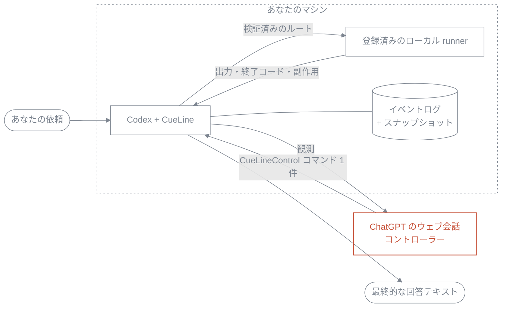

<picture>
  <source media="(prefers-color-scheme: dark)" srcset="docs/assets/cueline-banner-dark.svg">
  
</picture>

[](https://github.com/Seraphim0916/cueline/actions/workflows/ci.yml)

[English](README.md) · [繁體中文](README.zh-TW.md) · [简体中文](README.zh-CN.md) · **日本語** · [한국어](README.ko.md)

**CueLine は、開いている ChatGPT のウェブ会話にハンドルを渡します。会話側が実行全体を計画し、次の一手を出す。CueLine はそのコマンドを一つずつ検証し、実際の作業をここ、あなたのマシンで行います。**

ウェブページがあなたのマシンに触れることはありません。ページが出せるのは、1 ラウンドにつき小さなテキストコマンドが一つだけです。CueLine はそのコマンドが正しい形式か、この実行（run）に属するものか、どのローカルワーカーに対応するかを判断し、そのうえで実行し、証拠を保存し、証拠を返します。

CueLine は独立した実装で、**ランタイムの npm 依存はゼロ**です。Omnilane や GPT Relay のラッパーではありません。

## 1 回の実行は実際にどう進むか



各ラウンドで CueLine は、これから何を尋ねるのかをまず記録し、観測（observation）を 1 件だけ会話に送り、`<CueLineControl>` エンベロープを**ちょうど 1 つだけ**読み戻します。コントローラーは 5 つのアクション——`dispatch`、`wait`、`inspect`、`complete`、`blocked`——から 1 つを選び、エンベロープの外にあるテキストが実行されることは一切ありません。誤った run、誤ったラウンド、あるいは不正なジョブ定義を指すコマンドは、推測で補われることなく、回数制限つきの修復のために差し戻されます。ループは `complete` または `blocked` で停止し、ラウンド上限（既定 12 回）に達した場合も停止します。

コントローラーは*何が起こるべきか*を選びます。ローカル側は*それを許すか、どう許すか*を選びます。レーンが有効であること、候補がプロセス起動の**前に**利用可能だと確認されていること、`argv[0]` があなたのルーティング設定によってすでに登録されていること。シェルを経由するものは何もありません。ワーカーがいったん起動したら、黙って 2 番目の候補にフォールバックすることはありません。失敗は再試行ではなく、証拠として返ります。

これは許可リスト（allow-list）であって、サンドボックスではありません。登録されたワーカーは CueLine プロセス自身と同じ権限で動きます。`advise` は Codex の読み取り専用サンドボックスに、`work` は `workspace-write` に対応しますが、登録したものが、そのまま許可したものになります。

## クイックスタート

必要なもの：Node.js 22 以上、組み込みブラウザーを備えた Codex、そして——同梱の既定レーンを使う場合は——`PATH` 上の `codex` CLI。

```bash
git clone https://github.com/Seraphim0916/cueline.git
cd cueline
npm ci
npm run build
./install.sh      # ~/.codex/skills/cueline と ~/.local/bin/cueline のシンボリックリンクを作成
cueline doctor
```

`install.sh` が作るのはこの 2 つのシンボリックリンクだけです。自分が所有していないパスの上書きは拒否し、`./install.sh --uninstall` も自分が作ったリンクだけを削除します。

次に、Codex で：

1. Codex の組み込みブラウザーで `https://chatgpt.com` を開き、サインインします。
2. 主導させたい会話を選択したままにします。そのページで現在選ばれているモデルがコントローラーです。CueLine はモデルを切り替えませんし、プランの確認もしません。
3. Codex にこう頼みます：*「CueLine を使って、このリポジトリをレビューし、次の変更を証拠つきで提案して。」*
4. 返ってきた `runId` を控えておきます。中断した実行を再開する手がかりになります。

同梱の `cueline` スキルは、Codex 自身の Node ランタイムからこのパッケージを駆動します。組み込みブラウザーのオブジェクトはそこに存在するためです。別に起動したプレーンな `node` プロセスはそれを継承しません。

## コードから駆動する

```js
import { createCodexIabAdapter, runCueLine } from "cueline";

const result = await runCueLine({
  request: "Inspect the repository, delegate an implementation plan, and report the evidence.",
  browser: createCodexIabAdapter(),
  // 任意：conversationUrl、routingConfig / routingConfigPath、home、cwd、limits。
});

if (result.status === "complete") {
  console.log(result.finalDeliveryText);
}
```

`startCueLineRun` が明示的な開始点です（`runCueLine` はその別名）。`continueCueLineRun({ runId })` は中断した実行を同じ会話で再開し、新しいアダプターを渡さないかぎり保存済みの会話 URL を再利用します。`loadCueLineRunState(runId)` は永続化された状態を読むだけで、何も駆動しません。すでに `complete` または `blocked` に達した実行はそのまま返され、二度とディスパッチされません。

## CLI

CLI はブラウザーを駆動しません。ローカル側が健全かどうかを教えるだけです。

```console
$ cueline doctor
CueLine 0.1.0
status	ok
node	22.14.0	ok
config	/Users/you/cueline/config/routing.default.json	valid
home	/Users/you/.cueline
available_lanes	1

$ cueline routing
default	codex-default	available

$ cueline jobs
No jobs.

$ cueline config path
/Users/you/cueline/config/routing.default.json
```

Node が古すぎる場合、あるいは解決できるレーンが一つもない場合、`cueline doctor` は非ゼロで終了します。そのため事前チェックとしてそのまま使えます。`cueline routing` は、黙って別のものを選ぶのではなく、そのレーンがなぜ使えないのかを示します。`cueline help` ですべて一覧できます。

## 設定

`CUELINE_CONFIG` はルーティング設定ファイルを選び、`CUELINE_HOME` はローカル状態の置き場所を移します（既定は `~/.cueline`）。

同梱の `default` レーンには候補が 1 つ、`codex-default` があります。タスクを stdin で渡して `codex exec` を実行し、`advise` は `read-only`、`work` は `workspace-write` を使います。別のワーカーを登録するには、[`config/routing.default.json`](config/routing.default.json) をコピーして候補を追加し、`CUELINE_CONFIG` をそこに向けます。`argv[0]` の実行ファイルはその行為によって登録され、レーンが解決するにはそれが `PATH` 上にある必要もあります。

状態は `CUELINE_HOME` の下に置かれます：

```text
runs/<run-id>/events.jsonl    追記のみ、正本
runs/<run-id>/snapshot.json   リプレイの最適化、破棄可能
jobs/<job-id>.json            ジョブごとの実行証拠
```

記録そのものはイベントログです。コントローラーのターンは送信する前に書かれ、ジョブはプロセスが起動する前に登録されます。だからこそ、意図と副作用のあいだで中断が起きても痕跡が残ります。壊れたスナップショットは信用されず、無視されてイベント 1 番から再構築されます。

## 検証

```bash
npm ci
npm run typecheck
npm test
npm run smoke:fake
bash test/shell/install.test.sh
npm pack --dry-run
```

`npm run smoke:fake` は、偽のブラウザーと偽の runner を相手に、コントローラーループ全体をオフラインで走らせます。証明できるのはループであって、ライブのページではありません。後者を証明できるのは、組み込みブラウザーを通じて実際に完了した 1 ラウンドだけです。

## 0.1 の制限

テキストのみ。1 回の実行につき会話は 1 つ。モデル切り替え、画像、ファイルアップロード、Deep Research、Projects、Apps には対応しません。ワーカーが起動したあとの自動リトライやフォールバックはありません。失敗した `work` ジョブは、どこまで進んだか CueLine には証明できないため、副作用が不確定であるという印つきで報告されます。主なデスクトップ対象は macOS、CI 対象は Linux です。Windows は未検証で、`install.sh` は Windows 用インストーラーではありません。アダプターは現行の ChatGPT ウェブ UI に依存するため、UI が変わった場合は `COMPOSER_MISSING`、`SEND_BUTTON_MISSING`、あるいは応答タイムアウトとして明示的に表面化します——でっち上げの回答になることは決してありません。

完全な対応表は [compatibility](docs/compatibility.md) を参照してください。

## ドキュメント

[architecture](docs/architecture.md) · [controller protocol](docs/controller-protocol.md) · [runner contract](docs/runner-contract.md) · [state and recovery](docs/state-and-recovery.md) · [compatibility](docs/compatibility.md) · [provenance](docs/provenance.md)（いずれも英語）

## 開発

TypeScript、ESM、Node の組み込みモジュールのみ。`npm run build` は `dist/` へコンパイルし、テストは `node --test` でコンパイル済みの成果物に対して実行します。CI は Ubuntu と macOS 上の Node 22 / 24 を対象とします。

CueLine は独立したプロジェクトであり、OpenAI やその他いかなる企業とも提携しておらず、推奨・後援も受けていません。[provenance](docs/provenance.md) と [third-party notices](THIRD_PARTY_NOTICES.md) を参照してください。

## ライセンス

MIT。[LICENSE](LICENSE) を参照してください。
