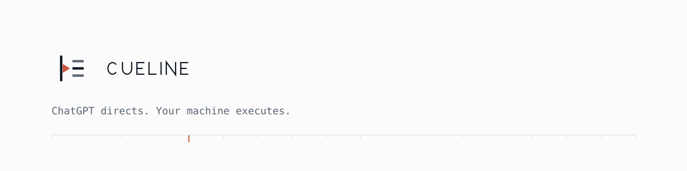
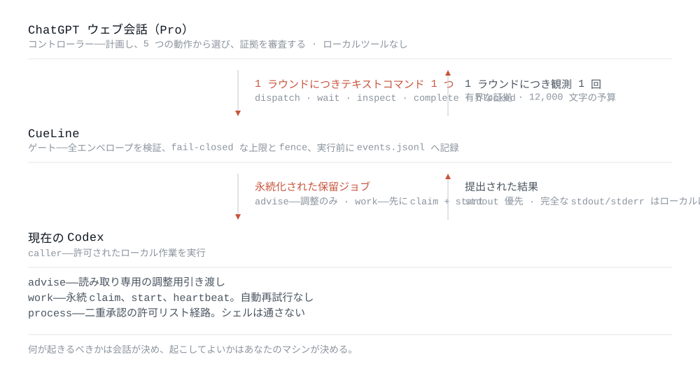
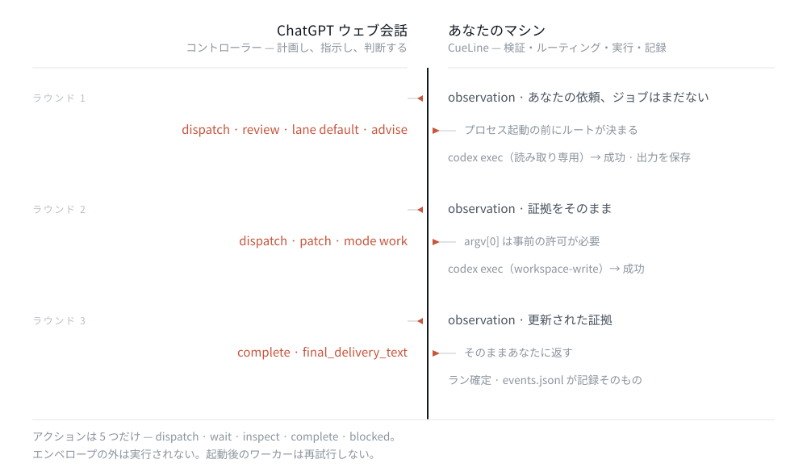
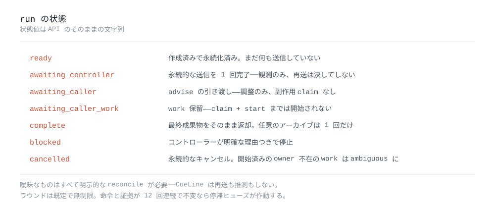

<picture>
  <source media="(prefers-color-scheme: dark)" srcset="docs/assets/cueline-banner-dark.svg">
  
</picture>

<p align="center">
  <a href="https://github.com/Seraphim0916/cueline/actions/workflows/ci.yml"></a>
  <a href="https://www.npmjs.com/package/cueline"></a>
  <a href="package.json"></a>
  <a href="LICENSE"></a>
</p>

<p align="center">
  <a href="README.md">English</a> · <a href="README.zh-TW.md">繁體中文</a> · <a href="README.zh-CN.md">简体中文</a> · <b>日本語</b> · <a href="README.ko.md">한국어</a>
</p>

CueLine は、Pro モデルを使用する 1 つの ChatGPT Web 会話に次の手順を判断させ、ローカルの Codex または Claude Code が明示的に claim した作業を実行します。
Web モデルの判断を使いつつ、Web ページにローカルツールを渡したくない開発者向けです。
各 run は再開可能で監査可能です。証拠が不明確な場合、CueLine は推測せずに停止します。



CueLine は独立した実装であり、**runtime npm 依存関係はありません**。Omnilane のラッパーではありません。

## CueLine は不確かな場合に停止します

CueLine はフェイルクローズ（fail-closed）です。送信が届いたか不明な場合、応答の run、round、request の識別子が一致しない場合、またはアクティブな ChatGPT タブが曖昧な場合、CueLine は run を凍結し、明示的な `reconcile` を求めます。推測も自動再送も行いません。

この挙動が重要なのは、ChatGPT にはローカルツールがないためです。コントローラーはテキストの指示だけを返し、ローカルの Codex または Claude Code がリポジトリの証拠を提供し、作業を明示的に claim し、ローカルで実行してよい内容を判断します。

## 最新リリース：0.7.7

- Claude Desktop ホストレーン：デーモンは保存済みの実行と会話を再開し、未取得のブリッジタイムアウトだけを最大 3 回再試行し、終了または古くなったフェーズでは待機をやめ、pid ロックでブリッジごとに 1 つのデーモンに限定します。ブリッジ要求は有効期限とデーモンの識別子を持ち、期限切れや不正な要求は隔離されます。
- 到達可能な Codex アプリ内ブラウザがない場合、継続は実行記録に触れる前に失敗します。
- `--json` を受け付けるすべてのコマンドに厳密な JSON Schema があり、`cueline doctor` は状態ディレクトリがグループや他のユーザーに開いていると警告し、正確な `chmod` 修正コマンドを示します。
- プロセスジョブは、子孫プロセスが出力パイプを保持していてもタイムアウトやキャンセル後に終了します。呼び出し側作業の復旧とクレーム解放も強化されました。

詳細は [0.7.7 changelog](CHANGELOG.md#077---2026-10-03) を参照してください。

### 0.7.6 の追加機能は継続

- `cueline install` は、管理対象の skill シンボリックリンク 2 本で標準では Codex と Claude Code の両方を接続します。3 つの CLI 実行ファイルは npm が提供します。`--codex-only` または `--claude-only` で範囲を限定できます。アンインストールは CueLine が作成したリンクだけを削除し、外部のパスは拒否します。
- Claude Code host lane の composer 準備待ちとブラウザー操作の時間枠は、`CUELINE_COMPOSER_READY_TIMEOUT_MS` と `CUELINE_BROWSER_OPERATION_TIMEOUT_MS` で上書きできます。既定値は 120000 と 180000 ミリ秒です。有効な値は 1000–3600000 で、無効な値は名前付きエラーを送出します。

詳細は [changelog](CHANGELOG.md#076---2026-08-31) またはバージョン指定の [v0.7.6 release](https://github.com/Seraphim0916/cueline/releases/tag/v0.7.6) を参照してください。

## 1 回の実行は実際にどう進むか



各ラウンドで CueLine は観測を送り、後で `<CueLineControl>` エンベロープを**ちょうど 1 つだけ**読み戻します。コントローラーは `dispatch`、`wait`、`inspect`、`complete`、`blocked` のいずれかを選びます。ループは 1 回の永続的な送信後に `awaiting_controller` で一時停止し、caller への引き渡し、`complete`、`blocked`、または連続停滞がヒューズしきい値に達した場合に停止します。

コントローラーコマンドには fail-closed なリソース上限もあります：エンベロープあたり 131,072 文字、dispatch あたり最大 64 ジョブ、wait / inspect あたり最大 256 個の明示 job ID。これらの検査はジョブ登録やプロセス起動の前に行われます。

コントローラーのラウンド数は既定で無制限です。正の整数 `maxRounds` を渡した場合だけ、owner 不在の一時停止をまたぐ永続的な総ラウンド上限が run に設定されます。後の続行では通常省略して既存値を再利用し、異なる値は拒否されます。既定のブレーキは永続的な 12 ラウンド停滞ヒューズです。CueLine は識別フィールドを除いた構造化コントローラー命令と、そのラウンドで実際に観測したジョブ証拠を指紋化し、どちらかが変化するとカウントをリセットします。12 回連続で変化がなければ `stagnation_detected` で run を終了します。

`startCueLineRun` と `runCueLine` の既定は `caller` です。送信後は `awaiting_controller` を返して lease を解放し、続行は 1 回の読み取り専用観測だけを行い、再送しません。`advise` は `awaiting_caller`、`work` は `awaiting_caller_work` を返します。work は現在の Codex が `claimCueLineCallerJob` と `startCueLineCallerJob` を成功させるまで開始されません。claim は run、job、task hash、絶対 workdir、caller identity、fencing token に結び付けられ、開始済み work は自動再試行されず、期限切れなら `ambiguous` になります。Pro はテキスト命令を提案・審査するだけで、ローカルツールは使いません。

Process モードは `executor: "process"` と `allowProcessExecution: true` の両方が必要で、非終端の続行でも第 2 の承認を再度渡します。組み込み route はさらに `--ignore-user-config` を使い、隠れた worker がユーザー設定の MCP server やそのコマンド引数を読み込まないようにします。レーンと候補は起動前に検証され、シェルも起動後の自動フォールバックも使いません。

コントローラープロトコルでは、ルーティングの階層を明確に区別します。`lane` に指定するのはレーン名の `default` であり、`codex-default` はそのレーン内の候補ランナーであって、レーンではありません。CueLine はジョブを一つでも登録する前に `dispatch` 全体を検証します。無効なレーンまたはランナーが一つでもあれば、途中まで実行せず、`dispatch` 全体を修正のために差し戻します。

これは許可リスト（allow-list）であって、サンドボックスではありません。登録されたワーカーは CueLine プロセス自身と同じ権限で動きます。`advise` は Codex の読み取り専用サンドボックスに、`work` は `workspace-write` に対応しますが、登録したものが、そのまま許可したものになります。

## run の状態

各 run は `~/.cueline/runs` に完全な追記専用（append-only）のイベント時系列として保存されます。切断、クラッシュ、新しいローカル session が run を消すことはありません。永続化された `runId` で再開できます。



`cueline run status <run-id> --json` は永続状態と `safeNextAction` を報告し、`cueline run doctor <run-id> --json` は同じスナップショットを安定した finding コードと安全な次の一手に変換します。曖昧なもの——送信されたかもしれないクリック、期限切れの開始済み claim、手動の添付送信——に対して、CueLine は再送せず停止し、明示的な reconcile を求めます。復旧の完全な契約は [state and recovery](docs/state-and-recovery.md) を参照してください。

## コントローラーは Pro モデルでなければなりません

コンポーザーのモデルセレクターが `Pro` を示していないかぎり、CueLine は送信を拒否します。会話が別のモデルにある場合、CueLine はまずコンポーザーを `Pro` に切り替えます——それが唯一許されたモデル切り替えです。検証済みのライブ実行では、Instant を Pro に切り替え、応答は `gpt-5-6-pro` として返りました。

選ぶことと、証明することは違います。各応答のあと CueLine は、完了したアシスタントメッセージのモデル slug を読み、それが Pro の slug であることを要求します。送信から返信までのあいだに格下げが起きても、信用せずに検出します。失敗は `MODEL_SELECTOR_MISSING`、`PRO_MODEL_UNAVAILABLE`、`PRO_MODEL_SELECTION_FAILED`、`PRO_MODEL_MISMATCH` として表面化し、受理された回答になることは決してありません。

ChatGPT Pro のサブスクリプションと、選択された Pro モデルは別物です。アカウントやプロフィールのラベルに `Pro` が含まれていても、それはサブスクリプションの証拠にすぎず、モデルの証拠には決してなりません。モデルの証拠になるのは応答のモデル slug だけです。ライブのターンごとに `controller_response_received` が `selected_model_label`、`response_model_slug`、`model_evidence_source` とともに永続化されるため、どちらの証拠がモデルを裏づけたのかは後からでも監査できます。

## クイックスタート

### Codex

以下のコマンドは標準インストーラーを使い、Codex と Claude Code の両方を接続します。Codex だけに限定する場合は、代わりに `cueline install --codex-only` を実行してください。

Node.js 22 以降、内蔵 Browser を備えた Codex、さらに同梱の既定 lane を使う場合は `PATH` 上の `codex` CLI が必要です。

npm registry からインストールします。

```bash
npm install -g cueline@0.7.7
cueline install
cueline doctor
```

代替として、バージョン付き tarball をインストールし、公開された `.sha256` checksum を検証できます。

```bash
npm install -g https://github.com/Seraphim0916/cueline/releases/download/v0.7.7/cueline-0.7.7.tgz
cueline install
cueline doctor
```

`cueline install` は管理対象の skill シンボリックリンクをちょうど 2 本作成し、標準では Codex と Claude Code を接続します。3 つの CLI 実行ファイルは npm が `package.json` の `bin` マッピングを通じて提供します。このコマンドは `~/.local/bin` のリンクを作成しません。`--codex-only` または `--claude-only` で範囲を限定できます。`cueline uninstall` は CueLine が作成したリンクだけを削除し、外部のパスを置換または削除することを拒否します。

### Claude Code

```bash
npm install -g cueline@0.7.7
cueline install --claude-only
cueline doctor
export CUELINE_HOST_BRIDGE="/absolute/path/to/host-bridge"
cueline-claude-desktop-lane status
cueline-claude-desktop-lane daemon "<task>"
```

次節の MCP server を設定してから、Claude Code Desktop のシェルツールで daemon を **Run in background** モードで起動してください。`&`、`nohup`、`disown` は追加しないでください。状態確認、復旧、継続に使うため、返された `runId` を保持してください。

標準インストールは両プラットフォームを接続する `cueline install` です。モデル駆動のブラウザー host では、より長い時間枠が必要になる場合があります。「設定」で説明する `CUELINE_COMPOSER_READY_TIMEOUT_MS` または `CUELINE_BROWSER_OPERATION_TIMEOUT_MS` を使用してください。

### MCP server

改行区切りの stdio で CueLine を起動するよう MCP client を設定します。

```json
{
  "mcpServers": {
    "cueline": {
      "command": "cueline",
      "args": ["mcp", "serve"]
    }
  }
}
```

実行時依存関係を持たないこの server は MCP `2025-11-25` を実装し、start、continue、サニタイズ済み status/doctor/list、フェンシング付き caller claim/start/heartbeat/progress ツールを公開します。生の transcript を返すことはありません。正確なツール呼び出しが `executor: "process"` と `allowProcessExecution: true` の両方を設定しない限り、process 実行は無効のままです。最初に成功した caller ツール呼び出しは stdio session を安定した明示的な `callerId` に結び付け、その後に正確な claim ID と fencing token が続きます。ブラウザーを進める呼び出しでは、server host が CueLine の内蔵 Browser binding を公開している必要があります。これを持たない通常の subprocess は `IAB_BROWSER_MISSING` を返しますが、永続的な start/status/doctor/list と caller fencing は利用できます。プロトコルを越えるのは JSON 安全な API オプションだけで、Browser、環境、時計、abort binding は host から注入されたままです。

### ソースからインストール

```bash
git clone https://github.com/Seraphim0916/cueline.git
cd cueline
npm ci
npm run build
./install.sh      # Codex と Claude Code のシンボリックリンクを作成
cueline doctor
```

`install.sh` は 5 本のシンボリックリンクだけを作成し、それ以外は行いません。`~/.codex/skills/cueline`、`~/.claude/skills/cueline-host`（`CLAUDE_CONFIG_DIR` が設定されている場合はその配下の `skills/cueline-host`）、`~/.local/bin/cueline`、`~/.local/bin/cueline-claude-desktop-lane`、`~/.local/bin/cueline-claude-desktop-mailbox` です。標準では両プラットフォームをインストールします。`--codex-only` または `--claude-only` を渡すと範囲を限定できます。所有していないパスの上書きを拒否し、`./install.sh --uninstall` は選択した範囲で自分が作成したリンクだけを削除します。

次に Codex で操作します。

1. Codex の内蔵 Browser で `https://chatgpt.com` を開き、サインインします。
2. コントローラーにしたい会話を選択したままにします。そのページがコントローラーです。選択中のタブがなく、条件に一致する ChatGPT タブが複数ある場合、CueLine は先頭を勝手に選ばず `IAB_CHATGPT_TAB_AMBIGUOUS` を返します。composer は `Pro` モデルでなければなりません。そうでない場合、CueLine は先に `Pro` を選択し、それができなければ送信を拒否します。
3. Codex に CueLine でタスクを処理するよう依頼します。*「CueLine を使い、開いている ChatGPT Pro の会話にこのタスクを指揮させてください。」*
4. 返された `runId` を保持します。中断した run を再開する際に使います。

同梱の `cueline` skill は、内蔵 Browser オブジェクトが存在する Codex 自身の Node runtime からこのパッケージを駆動します。脇で起動した通常の `node` プロセスはそれを継承しません。Claude Code Desktop も、同梱のファイル mailbox バイナリを通して同じコントローラーを host できます。[Claude Code Desktop から CueLine を駆動する](docs/claude-desktop-host.md)を参照してください。

### Claude Code Desktop host

npm パッケージには `cueline-host` skill と 2 つのコマンドが含まれます。

```bash
export CUELINE_HOST_BRIDGE="/absolute/path/to/host-bridge"
cueline-claude-desktop-lane status
cueline-claude-desktop-lane daemon "<task>"
```

上記の CueLine MCP server を設定し、Claude Code Desktop のシェルツールから daemon を **Run in background** モードで実行してください。シェルの `&`、`nohup`、`disown` は追加しないでください。Desktop harness がバックグラウンドタスクを管理します。host skill は mailbox request を 1 件 claim し、ブラウザー操作をちょうど 1 回実行して、未加工の結果を `cueline-claude-desktop-mailbox` で公開します。status が操作結果不明を報告した場合は、操作を再試行せず、永続化された lane の証拠を確認してください。完全な設定、request 方法、phase protocol、復旧規則は[Claude Code Desktop から CueLine を駆動する](docs/claude-desktop-host.md)を参照してください。

## コードから駆動する

```js
import {
  claimCueLineCallerJob,
  continueCueLineRun,
  createCodexIabAdapter,
  heartbeatCueLineCallerJob,
  runCueLine,
  startCueLineCallerJob,
  submitCueLineCallerJobResult,
} from "cueline";

let result = await runCueLine({
  request: "Inspect the repository, delegate an implementation plan, and report the evidence.",
  browser: createCodexIabAdapter({ browser: globalThis.browser }),
  // opt-in：archiveControllerConversationOnComplete: true,
  // 任意：conversationUrl、routingConfig / routingConfigPath、home、cwd、
  // runTimeoutMs、signal、ジョブごと／既定の期限。
}); // 既定は executor: "caller"

while (["awaiting_controller", "awaiting_caller", "awaiting_caller_work"].includes(result.status)) {
  if (result.status === "awaiting_controller") {
    await waitBeforeNextObservation(); // 有界バックオフ。再送しない
  } else if (result.status === "awaiting_caller") {
    for (const job of result.pendingJobs ?? []) {
      const stdout = await executeExactLocalAdvice(job.spec.task);
      await submitCueLineCallerJobResult(result.runId, job.jobId, {
        status: "succeeded",
        stdout,
      });
    }
  } else {
    for (const job of result.pendingJobs ?? []) {
      if (job.spec.mode !== "work") continue;
      const claim = await claimCueLineCallerJob(result.runId, job.jobId, { callerId: "stable-codex-task-identity" });
      const proof = { claimId: claim.claimId, callerId: claim.callerId, fencingToken: claim.fencingToken };
      await startCueLineCallerJob(result.runId, job.jobId, proof);
      const stdout = await executeExactLocalWork(job.spec.task, claim.resolvedWorkdir, {
        heartbeat: () => heartbeatCueLineCallerJob(result.runId, job.jobId, proof),
      });
      await submitCueLineCallerJobResult(result.runId, job.jobId, { status: "succeeded", stdout }, { claim: proof });
    }
  }
  result = await continueCueLineRun({ runId: result.runId });
}

if (result.status === "complete") {
  console.log(result.finalDeliveryText);
}
```

`archiveControllerConversationOnComplete` の既定は `false` で、run 作成時に固定されます。有効にすると、CueLine はまず `complete` を永続化し、その後 Pro がアイドルのあいだに、正確に結び付けられた会話だけをアーカイブします。永続クリックのチェックポイント前に証明された失敗は再試行できますが、その後のタイムアウト、再起動、遷移レース、証拠欠落はすべて `ambiguous` となり、CueLine が Archive を再クリックすることは二度とありません。`blocked` と `cancelled` の run は開いたまま残します。

`awaiting_controller` は再送なしの読み取り専用観測、`awaiting_caller` は advise の引き渡し、`awaiting_caller_work` は claim、start、実行、heartbeat、claim proof 付き提出の順です。Pro はローカルツールを直接使いません。

長時間の作業では `cueline_claim_caller_job` に大きい `ttlMs`（既定 300,000 ミリ秒、整数範囲 1,000–86,400,000 ミリ秒）を指定でき、MCP サーバー再起動後の `MCP_CALLER_WORK_CLAIM_NOT_IN_SESSION` には期限内に同じ `callerId` で再度 claim してから `cueline_start_caller_work_lease` を再開し、ID の変更は `CALLER_WORK_ALREADY_CLAIMED`、開始済み作業の期限切れは再開不能の `ambiguous` となり、自動再実行は禁止です。

`listCueLineRuns()` は永続化された run ID を見つけるための、読み取り専用でサニタイズ済みの一覧です。コントローラー本文、会話 URL、job のタスク、worker 出力は含まれません。

`verifyCueLineRun(runId)` は作成 marker、イベント replay と authority fence、任意の snapshot、runtime lease、job status 証拠を対象とする読み取り専用の整合性検査です。永続 run の内容は返さず、安定した finding だけを返します。

`confirmManualControllerSubmission(runId, …)` と `confirmControllerTurnNotSent(runId, …)` は、2 種類の reconcile 確認のプログラム用インターフェースです。どちらも追記のみで冪等であり、ブラウザーを駆動することも、何かを再送することもありません。

Codex のランタイムでは、`cueline api path` が出力する絶対パスのモジュールを import します。それがインストールしたパッケージのビルド済み API です。

`startCueLineRun` は永続 run を作成して `ready` を返すだけです。`runCueLine` は作成後、永続 controller 観測待ち、caller 引き渡し、または終端まで進めます。owner 不在の `controller_response_pending` で通常送信済みターンが一つだけあり、`safeNextAction: observe` が示される場合、同じ Pro 応答を読み取り専用で観測する待機です。少し待って続行し、再送しません。`safeNextAction: reconcile` は曖昧、手動送信、または複数の保留ターンに使います。owner 不在の `caller_jobs_pending` は正常なローカル引き渡しであり、orphan や ChatGPT 待ちではありません。CLI の `run status` は引き渡しに必要な metadata だけを出力し、task 本文、caller identity、task hash、workdir、runtime owner ID を含めません。正式な claim 後にだけ、API が正確な task と workdir を認可された caller に返します。

### ChatGPT controller 会話のピン留め

run の ChatGPT Pro controller 会話が `/c/<conversation-id>` URL で永続的に束縛されると、CueLine はその会話が Web サイドバーの Pinned セクションに現れることを自動的に保証します。この操作は冪等です。サイドバーのメニューに既存の `Unpin chat` 項目があれば、その会話が既にピン留めされている証明になり、新たな Pin クリックも同じ証明を生成しなければなりません。ピン留め状態は run 単位なので、並行する run はそれぞれ自分の会話を独立してピン留めします。CueLine が完了した会話のピンを自動的に外すことはなく、手動でピン留めされたチャットに触れることもありません。

### 会話コンテキスト枯渇時のローテーション

CueLine は 90K／400K のしきい値を推測せず、API の context window を ChatGPT Web の証拠として扱いません。正確にバインドされた会話が応答中ではなく、オペレーターがコンテキスト枯渇専用の表示を確認した場合だけ、同じ run を `rotateControllerConversation: { trigger: "operator_confirmed_context_exhausted", evidence: "..." }` で継続します。後継会話は独自の正確な URL と Pin を持ち、先行会話と並行 run の Pin は保持されます。一般的な timeout、利用上限、ポリシー拒否、認証、サービス／モデル、selector のエラーはローテーションを起動しません。LLM 向けの完全な呼び出し契約は `skills/cueline/SKILL.md` を参照してください。

## CLI

主なコマンドは `cueline run status`、`run doctor`、`run timeline`、`run verify`、`run export`、`run reconcile`、`run takeover`、`run cancel` です。孤立した run は `cueline runs sweep` で整理し、コントローラーのエンベロープは `cueline protocol lint` でオフライン検証し、`cueline mcp serve` で stdio 経由の境界付きツールを公開します。

CLI はブラウザーを駆動しません。状態を書き込むコマンドの前に `cueline help` で完全な引数を確認してください。

| グループ | コマンド | 効果 |
| --- | --- | --- |
| 参照 | `doctor` · `routing` · `routing explain` · `jobs` · `runs` · `run status` · `run status-at` · `run diff` · `run doctor` · `run watch` · `run timeline` · `run graph` · `run verify` · `run handoff` · `protocol lint` · `api path` · `config path` | 読み取り専用 |
| インストール | `install` · `uninstall` | パッケージ所有のスキルリンクだけを作成・削除 |
| 復旧 | `run reconcile` · `run takeover` · `run reconcile-runtime` · `run cancel` / `run stop` · `job cancel` | 監査証拠の追記、または永続 run/job 状態の変更 |

```console
$ cueline doctor
CueLine 0.7.7
status	ok
node	22.14.0	ok
config	/usr/local/lib/node_modules/cueline/config/routing.default.json	valid
home	/Users/you/.cueline
caller_ready	yes
caller_lanes	1
process_available_lanes	1

$ cueline routing
default	codex-default	available

$ cueline run status run_... --json
{"status":"running","executor":"caller","phase":"caller_jobs_pending","runtime":{"ownership":"missing"},...}

$ cueline run doctor run_... --json
{"outcome":"action_required","phase":"caller_jobs_pending","nextAction":"execute_caller_jobs",...}

$ cueline run reconcile run_... --request-id msg_... --manual-send-confirmed --conversation-url https://chatgpt.com/c/...
run_...\tmsg_...\tconfirmed

$ cueline run cancel run_...
run_...	requested	affected_jobs=0
```

Node が古すぎる場合、または有効な caller レーンが一つもない場合、`cueline doctor` は非ゼロで終了します。`process_available_lanes` が 0 でも caller モードは劣化しません。process executor を明示的に選ぶ前だけ `cueline routing` で process の可用性を確認してください。`cueline api path` が出すのはスキルが import するモジュールなので、パッケージ導入ならリポジトリの取得は不要です。`cueline help` は `--json` と手動 reconcile の必須確認フラグを含む各コマンドの正確な構文を一覧します。

0.2.0 で追加された 4 つの可観測性コマンドは、すべて厳密に読み取り専用です。`run status-at` は単一の正確なイベント連番の時点にサニタイズ済み run 状態を再構築します——「その瞬間に CueLine が知っていたこと」です。`run diff` は 2 つのサニタイズ済み run サマリーをフィールド単位で比較し、生のプロンプトや出力は決して含めません。`run graph` はサニタイズ済み timeline エントリから有界の Mermaid 制御フロー図を描画します。`routing explain` はプロセス起動前に、レーン選択・可用性・却下理由を runner の引数を漏らさずに説明します（[multi-model routing](docs/multi-model-routing.md) を参照）。

実験的な診断コマンドには、それぞれ専用のドキュメントがあります：

| コマンド | 役割 | ドキュメント |
| --- | --- | --- |
| `run doctor` | run スナップショットを安定した finding コード、有界な証拠、安全な次の一手に変換（状態は書き込まない） | [run-doctor](docs/experiments/run-doctor.md) |
| `run watch` | 永続イベント連番をカーソルにした、有界で lease を取らない観測 | [run-watch](docs/experiments/run-watch.md) |
| `protocol lint` | Pro エンベロープをオフラインで検証し、既知の契約修正を一括報告 | [protocol-lint](docs/experiments/protocol-lint.md) |
| `run handoff` | 正確な identity と絶対パスを備えた安全な再開パケットを生成 | [run-handoff](docs/experiments/run-handoff.md) |
| `run timeline` | 生イベントを含まない、サニタイズ済みカーソルページングの監査ビュー | [run-timeline](docs/experiments/run-timeline.md) |

`run takeover` は `run status` が exact stale owner を示す場合だけ使います。新しい active heartbeat は拒否されます。返された `next: continue` または `next: reconcile_runtime` に従い、推測で進めないでください。

## 設定

Claude Code host lane では、`CUELINE_COMPOSER_READY_TIMEOUT_MS` と `CUELINE_BROWSER_OPERATION_TIMEOUT_MS` により、既定の 120000 ミリ秒と 180000 ミリ秒を上書きできます。どちらも 1000–3600000 の整数でなければなりません。無効な値は名前付きエラーを送出し、既定値へ黙って戻ることはありません。

`CUELINE_CONFIG` はルーティング設定ファイルを選び、`CUELINE_HOME` はローカル状態の置き場所を移します（既定は `~/.cueline`）。

Caller はプロセスを起動しません。`executor: "process"` と `allowProcessExecution: true` を同時に指定した場合だけ、`default` レーンの `codex-default` が隔離された `codex exec --ignore-user-config` を実行します。独立した `advise` の既定同時実行数は全体／レーンごとに 2、`work` を含むバッチは直列です。別の process worker を登録するには、[`config/routing.default.json`](config/routing.default.json) をコピーして候補を追加し、`CUELINE_CONFIG` をそこへ向けます。

モデル別の複数候補の登録方法と advise 専用ラッパーの例は、[multi-model routing](docs/multi-model-routing.md) を参照してください。

状態は `CUELINE_HOME` の下に置かれます：

```text
runs/<run-id>/events.jsonl + events.jsonl.segments/   追記のみ、正本
runs/<run-id>/runtime.json.fence + runtime.json.epochs/   世代分離されたライブ owner heartbeat 証拠
runs/<run-id>/runtime.json.retired-owners/   不変の旧 owner イベント cutoff
runs/<run-id>/runtime.json.takeover-intents/   不変の exact takeover 試行記録
runs/<run-id>/cancel.json    存在する場合は永続キャンセル要求
runs/<run-id>/snapshot.json   リプレイの最適化、破棄可能
jobs/<job-id>.json            ジョブごとの実行証拠
```

記録そのものはイベントログです。コントローラーのターンは送信する前に書かれ、ジョブはプロセスが起動する前に登録されます。だからこそ、意図と副作用のあいだで中断が起きても痕跡が残ります。壊れたスナップショットは信用されず、無視されてイベント 1 番から再構築されます。

復帰は完全に同じ会話 URL にだけ接続します。ChatGPT が長文を添付に自動変換した場合は `attachment_ready` として認識し、送信クリックは最大 1 回です。曖昧なクリックは `possibly_sent` となり再送しません。実際に見えて有効かつ操作可能な Stop コントロールがあるあいだだけ、応答は進行中とみなされます。隠れた残存ボタンが完了済みの Pro 応答を抑え込むことはありません。手動送信後は `cueline run reconcile RUN_ID --request-id REQUEST_ID --manual-send-confirmed` で正式に確認し、同一 conversation、Pro 証拠、protocol/run/round/request identity をすべて検証します。

逆方向の確認は「クリックが確実に届かなかった」場合のためのものです。操作者がその正確な会話を直接確認し、メッセージが存在しないことを確かめたうえで、`cueline run reconcile ... --not-sent-confirmed --conversation-url URL` を実行すると、旧 request identity を追記のみで放棄し、新しい決定的 request ID によるちょうど 1 回の同一プロンプト再試行を承認します。2 つのフラグは相互排他です。放棄したメッセージまたはその応答が後から現れた場合、CueLine は run を凍結して人手のレビューに回し、受理も再送も決して行いません。

Pro が回答しているあいだは、決して中断せず、`Answer now`、`Respond now`、`Stop` などの加速コントロールも使わないでください。Pro にはローカルツールがなく、リポジトリ構成やローカルパスの既定知識もありません。Caller の証拠には正確なコード／エラー識別子、関連コードの抜粋、絶対ローカルパスを含め、さらにローカル証拠が必要か Pro に明示的に尋ねてください。

コントローラー証拠は成功時の非空 stdout を優先し、全体 12,000 文字に制限します。完全な stdout/stderr はローカルに保持します。Pro が `inspect(job_ids)` を受理した場合、次のターンでは指定 job の証拠予算を先に確保してから無関係な証拠を扱います。

## 検証

```bash
npm ci
npm run typecheck
npm test
npm run smoke:fake
bash test/shell/install.test.sh
npm pack --dry-run
```

`npm run smoke:fake` は、偽のブラウザーと偽の runner を相手に、コントローラーループ全体をオフラインで走らせます。証明できるのはループであって、ライブのページではありません。後者を証明できるのは、組み込みブラウザーを通じて実際に完了した 1 ラウンドだけです。

## 0.7.7 での既知の制限

テキストコマンドのみ。1 回の run につき会話は 1 つです。`Pro` の選択が CueLine が行う唯一のモデル切り替えです。長文の自動添付変換は対応しますが、意図的なファイルアップロード、画像、Deep Research、Projects、Apps は非対応です。Caller work は明示的な claim/start と、長時間作業では heartbeat が必要です。process 実行は二重承認が必要です。曖昧な送信や開始済みジョブを自動再試行しません。macOS が主要デスクトップターゲット、Linux が CI ターゲットで、Windows は未検証です。アダプターは現行の ChatGPT ウェブ UI に依存するため、UI 変更は捏造された回答ではなく明示的なエラーとして表面化します。

完全な対応表は [compatibility](docs/compatibility.md) を参照してください。

## ドキュメント

| ドキュメント | 内容 |
| --- | --- |
| [architecture](docs/architecture.md) | 各コンポーネントの構成と信頼境界の位置 |
| [controller protocol](docs/controller-protocol.md) | `<CueLineControl>` エンベロープ、5 つの動作、修正ルール |
| [runner contract](docs/runner-contract.md) | 登録済み process worker がすべきこと・してはならないこと |
| [state and recovery](docs/state-and-recovery.md) | 永続状態のレイアウト、ownership、すべての復旧経路 |
| [multi-model routing](docs/multi-model-routing.md) | 追加の process worker の登録方法と、コントローラーが実際に見えるもの |
| [compatibility](docs/compatibility.md) | 対応プラットフォーム、ランタイム、UI 前提 |
| [provenance](docs/provenance.md) | 設計の由来と、CueLine が何でないか |

（いずれも英語）

## 開発

TypeScript、ESM、Node の組み込みモジュールのみ。`npm run build` は `dist/` へコンパイルし、テストは `node --test` でコンパイル済みの成果物に対して実行します。CI は Ubuntu と macOS 上の Node 22 / 24 / 26 を対象とします。

CueLine は独立したプロジェクトであり、OpenAI やその他いかなる企業とも提携しておらず、推奨・後援も受けていません。[provenance](docs/provenance.md) と [third-party notices](THIRD_PARTY_NOTICES.md) を参照してください。

## ライセンス

MIT。[LICENSE](LICENSE) を参照してください。
