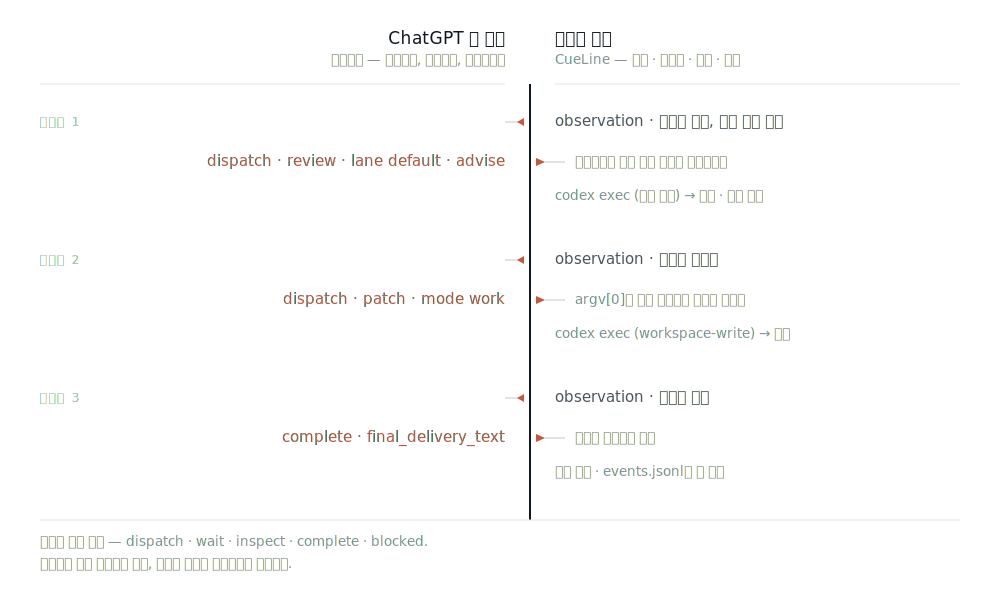

<picture>
  <source media="(prefers-color-scheme: dark)" srcset="docs/assets/cueline-banner-dark.svg">
  
</picture>

<p align="center">
  <a href="https://github.com/Seraphim0916/cueline/actions/workflows/ci.yml"></a>
</p>

<p align="center">
  <a href="README.md">English</a> · <a href="README.zh-TW.md">繁體中文</a> · <a href="README.zh-CN.md">简体中文</a> · <a href="README.ja.md">日本語</a> · <b>한국어</b>
</p>

**CueLine은 이미 열려 있는 ChatGPT 웹 대화에 운전대를 넘깁니다. 대화가 실행 전체를 계획하고 다음 단계를 지시하면, CueLine은 모든 명령을 검증하고 실제 작업은 바로 이곳, 당신의 머신에서 수행합니다.**

웹 페이지는 당신의 머신을 건드리지 않습니다. 페이지가 내보내는 것은 라운드당 작은 텍스트 명령 하나뿐입니다. CueLine은 그 명령의 형식이 올바른지, 이번 실행(run)에 속하는지, 어떤 로컬 워커에 대응하는지를 판단한 뒤에야 실행하고, 증거를 보관하고, 그 증거를 돌려줍니다.

CueLine은 독립적인 구현이며 **런타임 npm 의존성이 전혀 없습니다**. Omnilane이나 GPT Relay를 감싼 래퍼가 아닙니다.

## 실행 한 번은 실제로 이렇게 흘러갑니다



매 라운드마다 CueLine은 무엇을 물으려 하는지 먼저 기록하고, 관측(observation) 하나를 대화에 보낸 뒤, `<CueLineControl>` 엔벨로프를 **정확히 하나만** 읽어 옵니다. 컨트롤러는 다섯 가지 동작 — `dispatch`, `wait`, `inspect`, `complete`, `blocked` — 중 하나를 고르며, 엔벨로프 바깥의 텍스트는 절대 실행되지 않습니다. 잘못된 run이나 잘못된 라운드를 가리키거나 작업 정의가 잘못된 명령은 추측으로 메워지지 않고, 횟수가 제한된 복구 시도를 위해 되돌려 보내집니다. 루프는 `complete` 또는 `blocked`에서 멈추며, 라운드 한도(기본 12회)를 소진해도 멈춥니다.

컨트롤러는 *무엇이 일어나야 하는지*를 고릅니다. 로컬 쪽은 *그것이 허용되는지, 어떻게 허용되는지*를 고릅니다. 레인이 활성화되어 있어야 하고, 후보는 어떤 프로세스가 뜨기 **전에** 사용 가능함이 확인되어야 하며, `argv[0]`은 당신의 라우팅 설정에 이미 등록되어 있어야 합니다. 셸을 거치는 것은 아무것도 없습니다. 워커가 일단 시작되면 두 번째 후보로 조용히 넘어가는 폴백은 없습니다. 실패는 재시도가 아니라 증거로 돌아옵니다.

이것은 허용 목록(allow-list)이지 샌드박스가 아닙니다. 등록된 워커는 CueLine 프로세스 자신과 동일한 권한으로 실행됩니다. `advise`는 Codex의 읽기 전용 샌드박스에, `work`는 `workspace-write`에 대응하지만, 당신이 등록한 것이 곧 당신이 승인한 것입니다.

## 빠른 시작

필요한 것: Node.js 22 이상, 내장 브라우저를 갖춘 Codex, 그리고 — 기본 제공 레인을 쓴다면 — `PATH` 위의 `codex` CLI.

[v0.1.0 릴리스](https://github.com/Seraphim0916/cueline/releases/tag/v0.1.0)의 패키지 tarball을 설치합니다. 같은 릴리스에 `.sha256` 체크섬도 함께 있습니다.

```bash
npm install -g https://github.com/Seraphim0916/cueline/releases/download/v0.1.0/cueline-0.1.0.tgz
cueline install
cueline doctor
```

CueLine은 npm 레지스트리에 게시되어 있지 않습니다. 받는 방법은 위의 릴리스 자산, 또는 아래의 소스 경로입니다.

`cueline install`이 만드는 심볼릭 링크는 하나뿐입니다. 번들된 스킬을 `$CODEX_HOME/skills/cueline`(기본값 `~/.codex/skills/cueline`)에 연결합니다. 자신이 소유하지 않은 경로는 덮어쓰기를 거부하고, 두 번 실행해도 아무것도 달라지지 않습니다. `cueline uninstall`은 그 링크만 제거하며, 그 자리에 다른 파일이 있으면 지우지 않고 보존합니다.

### 소스에서 설치하기

```bash
git clone https://github.com/Seraphim0916/cueline.git
cd cueline
npm ci
npm run build
./install.sh      # ~/.codex/skills/cueline 과 ~/.local/bin/cueline 심볼릭 링크 생성
cueline doctor
```

`install.sh`는 이 두 개의 심볼릭 링크만 만듭니다. 자신이 소유하지 않은 경로는 덮어쓰기를 거부하며, `./install.sh --uninstall` 역시 자신이 만든 링크만 제거합니다.

그다음 Codex에서:

1. Codex의 내장 브라우저로 `https://chatgpt.com`을 열고 로그인합니다.
2. 지휘를 맡길 대화를 선택한 상태로 둡니다. 그 페이지에서 현재 선택된 모델이 컨트롤러입니다. CueLine은 모델을 바꾸지 않고, 요금제를 확인하지도 않습니다.
3. Codex에게 CueLine으로 처리해 달라고 요청합니다: *"CueLine으로: 이 저장소를 검토하고 다음 변경을 증거와 함께 제안해 줘."*
4. 반환된 `runId`를 보관하세요. 중단된 실행을 이어서 진행하는 열쇠입니다.

기본 제공 `cueline` 스킬은 Codex 자체의 Node 런타임에서 이 패키지를 구동합니다. 내장 브라우저 객체가 바로 그곳에 있기 때문입니다. 옆에서 따로 띄운 평범한 `node` 프로세스는 그것을 물려받지 못합니다.

## 코드에서 구동하기

```js
import { createCodexIabAdapter, runCueLine } from "cueline";

const result = await runCueLine({
  request: "Inspect the repository, delegate an implementation plan, and report the evidence.",
  browser: createCodexIabAdapter(),
  // 선택: conversationUrl, routingConfig / routingConfigPath, home, cwd, limits.
});

if (result.status === "complete") {
  console.log(result.finalDeliveryText);
}
```

Codex 런타임에서는 `cueline api path`가 출력하는 절대 경로 모듈을 import하세요. 그것이 설치한 패키지의 빌드된 API입니다.

`startCueLineRun`이 명시적인 시작점입니다(`runCueLine`은 그 별칭). `continueCueLineRun({ runId })`은 중단된 실행을 같은 대화에서 재개하며, 새 어댑터를 넘기지 않는 한 저장된 대화 URL을 재사용합니다. `loadCueLineRunState(runId)`는 저장된 상태를 읽기만 하고 아무것도 구동하지 않습니다. 이미 `complete`나 `blocked`에 도달한 실행은 그대로 반환되며, 두 번 디스패치되지 않습니다.

## CLI

CLI는 브라우저를 구동하지 않습니다. 스킬 링크를 관리하고, 로컬 쪽이 멀쩡한지 알려줍니다.

```console
$ cueline install
CueLine skill installed: /Users/you/.codex/skills/cueline

$ cueline doctor
CueLine 0.1.0
status	ok
node	22.14.0	ok
config	/usr/local/lib/node_modules/cueline/config/routing.default.json	valid
home	/Users/you/.cueline
available_lanes	1

$ cueline api path
/usr/local/lib/node_modules/cueline/dist/src/api.js

$ cueline routing
default	codex-default	available

$ cueline jobs
No jobs.

$ cueline config path
/usr/local/lib/node_modules/cueline/config/routing.default.json

$ cueline uninstall
CueLine skill removed: /Users/you/.codex/skills/cueline
```

Node 버전이 너무 낮거나 해석 가능한 레인이 하나도 없으면 `cueline doctor`는 0이 아닌 코드로 종료합니다. 그래서 사전 점검용으로 그대로 쓸 수 있습니다. `cueline routing`은 조용히 다른 것을 고르는 대신, 그 레인이 왜 사용 불가인지 보여줍니다. `cueline api path`가 출력하는 것이 곧 스킬이 import하는 모듈이므로, 패키지로 설치했다면 저장소를 받을 필요가 없습니다. `cueline help`가 전부를 나열합니다.

## 설정

`CUELINE_CONFIG`는 라우팅 설정 파일을 고르고, `CUELINE_HOME`은 로컬 상태의 위치를 옮깁니다(기본값 `~/.cueline`).

기본 제공 `default` 레인에는 후보가 하나, `codex-default`가 있습니다. 작업을 stdin으로 넘겨 `codex exec`를 실행하며, `advise`에는 `read-only`, `work`에는 `workspace-write`를 씁니다. 다른 워커를 등록하려면 [`config/routing.default.json`](config/routing.default.json)을 복사해 후보를 추가하고 `CUELINE_CONFIG`를 그쪽으로 가리키면 됩니다. `argv[0]`의 실행 파일은 바로 그 행위로 등록되며, 레인이 해석되려면 그것이 `PATH` 위에도 있어야 합니다.

상태는 `CUELINE_HOME` 아래에 놓입니다:

```text
runs/<run-id>/events.jsonl    추가 전용, 정본
runs/<run-id>/snapshot.json   재생 최적화용, 버려도 무방
jobs/<job-id>.json            작업별 실행 증거
```

기록 그 자체는 이벤트 로그입니다. 컨트롤러의 턴은 보내기 전에 기록되고, 작업은 프로세스가 시작되기 전에 등록됩니다. 그래서 의도와 부작용 사이에서 중단이 일어나도 흔적이 남습니다. 손상된 스냅샷은 신뢰되지 않고, 무시된 뒤 이벤트 1번부터 다시 만들어집니다.

## 검증

```bash
npm ci
npm run typecheck
npm test
npm run smoke:fake
bash test/shell/install.test.sh
npm pack --dry-run
```

`npm run smoke:fake`는 가짜 브라우저와 가짜 runner를 상대로 컨트롤러 루프 전체를 오프라인으로 돌립니다. 이것이 증명하는 것은 루프이지 실제 페이지가 아닙니다. 후자는 내장 브라우저를 통해 실제로 완료된 한 라운드만이 증명할 수 있습니다.

## 0.1의 한계

텍스트 전용. 실행 하나당 대화 하나. 모델 전환, 이미지, 파일 업로드, Deep Research, Projects, Apps는 지원하지 않습니다. 워커가 시작된 뒤의 자동 재시도나 폴백도 없습니다. 실패한 `work` 작업은 어디까지 진행됐는지 CueLine이 증명할 수 없으므로, 부작용이 불확실하다는 표시와 함께 보고됩니다. 주력 데스크톱 대상은 macOS이고 CI 대상은 Linux입니다. Windows는 검증되지 않았으며 `install.sh`는 Windows용 설치 프로그램이 아닙니다. 어댑터는 현재의 ChatGPT 웹 UI에 의존하므로, UI가 바뀌면 `COMPOSER_MISSING`, `SEND_BUTTON_MISSING`, 또는 응답 타임아웃으로 명시적으로 드러납니다 — 지어낸 답으로 둔갑하는 일은 결코 없습니다.

전체 표는 [compatibility](docs/compatibility.md)를 보세요.

## 문서

[architecture](docs/architecture.md) · [controller protocol](docs/controller-protocol.md) · [runner contract](docs/runner-contract.md) · [state and recovery](docs/state-and-recovery.md) · [compatibility](docs/compatibility.md) · [provenance](docs/provenance.md) (모두 영어)

## 개발

TypeScript, ESM, Node 내장 모듈만 사용합니다. `npm run build`는 `dist/`로 컴파일하고, 테스트는 `node --test`로 컴파일된 결과물을 대상으로 실행합니다. CI는 Ubuntu와 macOS의 Node 22와 24를 다룹니다.

CueLine은 독립 프로젝트이며 OpenAI를 비롯한 어떤 회사와도 제휴하거나 보증·후원을 받지 않았습니다. [provenance](docs/provenance.md)와 [third-party notices](THIRD_PARTY_NOTICES.md)를 참고하세요.

## 라이선스

MIT. [LICENSE](LICENSE)를 참고하세요.
