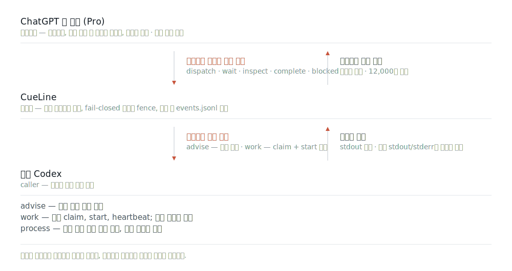
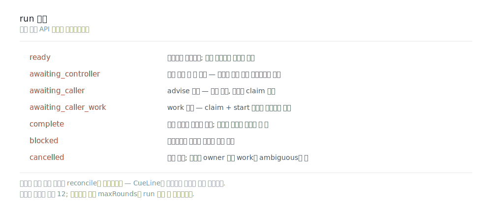

<picture>
  <source media="(prefers-color-scheme: dark)" srcset="docs/assets/cueline-banner-dark.svg">
  
</picture>

<p align="center">
  <a href="https://github.com/Seraphim0916/cueline/actions/workflows/ci.yml"></a>
  <a href="https://www.npmjs.com/package/cueline"></a>
  <a href="package.json"></a>
  <a href="LICENSE"></a>
</p>

<p align="center">
  <a href="README.md">English</a> · <a href="README.zh-TW.md">繁體中文</a> · <a href="README.zh-CN.md">简体中文</a> · <a href="README.ja.md">日本語</a> · <b>한국어</b>
</p>

**CueLine은 열린 ChatGPT 웹 대화에 판단을 맡깁니다. 대화는 텍스트 명령을 내리고, CueLine이 검증하며, 현재 Codex가 허용된 로컬 작업을 수행합니다.**

웹 페이지는 당신의 머신에 닿을 수 없고 로컬 도구도 없습니다. 라운드마다 텍스트 명령 하나만 내보냅니다. 기본 `caller` 실행에서 `advise`는 조정용 인계이며, `work`는 지속 claim과 start가 필요합니다. 등록된 워커를 띄우는 process executor는 이중 명시 승인이 필요합니다.



CueLine은 독립적인 구현이며 **런타임 npm 의존성이 전혀 없습니다**. Omnilane을 감싼 래퍼가 아닙니다.

## 최신 릴리스: 0.4.3

- 재시작 후 완료된 첨부형 ChatGPT Pro 응답을 수락하지 못하는 문제를 수정했습니다. 새 페이지 하이드레이션에서 영속 baseline보다 적은 과거 assistant 노드만 마운트되어도 정확한 run／round／request envelope로 응답을 수락합니다. exact URL, 이중 Pro 증거, user count, 하이드레이션, idle 안전 검사는 fail-closed 상태로 유지됩니다. 실제 round 35는 재전송과 중복 job 없이 복구되었고 559/559 테스트를 통과했습니다.

전체 내용은 [changelog](CHANGELOG.md#043---2026-07-19) 또는 버전이 지정된 [v0.4.3 release](https://github.com/Seraphim0916/cueline/releases/tag/v0.4.3)에서 확인할 수 있습니다.

## 실행 한 번은 실제로 이렇게 흘러갑니다


매 라운드마다 CueLine은 관측 하나를 보내고 나중에 `<CueLineControl>` 엔벨로프를 **정확히 하나만** 읽습니다. 컨트롤러는 `dispatch`, `wait`, `inspect`, `complete`, `blocked` 중 하나를 고릅니다. 루프는 한 번의 영속적인 전송 뒤 `awaiting_controller`에서 일시 중지하며 caller 인계, `complete`, `blocked`, 또는 라운드 상한(기본 12회)에서도 멈춥니다.

컨트롤러 명령에는 fail-closed 자원 한도도 있습니다: 엔벨로프당 131,072자, dispatch당 최대 64개 작업, wait/inspect당 최대 256개의 명시적 job ID. 이 검사는 작업 등록이나 프로세스 시작 전에 수행됩니다.

기본값이 아닌 `maxRounds`는 run 생성 시 고정되며 owner가 없는 일시 중지를 가로질러 컨트롤러 총 라운드 수를 셉니다. 이후 계속하기에서는 보통 생략해 지속 값을 재사용하고, 다른 값을 전달하면 예산을 몰래 재설정하거나 늘리지 않고 거부합니다.

`startCueLineRun`과 `runCueLine`의 기본값은 `caller`입니다. 전송 뒤 `awaiting_controller`를 반환하고 lease를 해제하며, 계속하기는 재전송 없이 읽기 전용 관측 한 번만 수행합니다. `advise`는 `awaiting_caller`, `work`는 `awaiting_caller_work`를 반환합니다. work는 현재 Codex가 `claimCueLineCallerJob`과 `startCueLineCallerJob`을 성공시키기 전에는 시작되지 않습니다. claim은 run, job, task hash, 절대 workdir, caller identity, fencing token에 묶이며 시작된 work는 자동 재시도되지 않고 만료 시 `ambiguous`가 됩니다. Pro는 텍스트 명령을 제안하고 검토할 뿐 로컬 도구를 쓰지 않습니다.

Process 모드는 `executor: "process"`와 `allowProcessExecution: true`가 모두 필요하며, 비종료 계속하기에서도 두 번째 승인을 다시 전달해야 합니다. 번들 route는 `--ignore-user-config`도 사용하므로 숨은 worker가 사용자 설정 MCP server나 그 명령 인자를 로드하지 않습니다. 레인과 후보는 시작 전에 검증되고 셸이나 시작 후 자동 폴백은 사용하지 않습니다.

컨트롤러 프로토콜은 라우팅 계층을 명확히 구분합니다. `lane`에는 레인 이름인 `default`를 써야 하며, `codex-default`는 그 레인 안의 후보 러너이지 레인이 아닙니다. CueLine은 작업을 하나라도 등록하기 전에 `dispatch` 전체를 검증합니다. 잘못된 레인이나 러너가 하나라도 있으면 일부를 먼저 실행하지 않고 `dispatch` 전체를 수정하도록 돌려보냅니다.

이것은 허용 목록(allow-list)이지 샌드박스가 아닙니다. 등록된 워커는 CueLine 프로세스 자신과 동일한 권한으로 실행됩니다. `advise`는 Codex의 읽기 전용 샌드박스에, `work`는 `workspace-write`에 대응하지만, 당신이 등록한 것이 곧 당신이 승인한 것입니다.

## run 상태



`cueline run status <run-id> --json`은 지속 상태와 `safeNextAction`을 보고하고, `cueline run doctor <run-id> --json`은 같은 스냅샷을 안정적인 finding 코드와 안전한 다음 한 걸음으로 바꿔 줍니다. 모호한 것 — 보냈을 수도 있는 클릭, 만료된 시작 claim, 수동 첨부 전송 — 앞에서 CueLine은 재전송 대신 멈추고 명시적 reconcile을 요구합니다. 복구 계약 전문은 [state and recovery](docs/state-and-recovery.md)를 보세요.

## 컨트롤러는 반드시 Pro 모델이어야 합니다

컴포저의 모델 선택기가 `Pro`를 가리키지 않으면 CueLine은 전송을 거부합니다. 대화가 다른 모델에 머물러 있으면 CueLine이 먼저 컴포저를 `Pro`로 전환합니다 — 이것이 CueLine에게 허용된 유일한 모델 전환입니다. 검증된 실제 실행에서 CueLine은 Instant를 Pro로 전환했고, 응답은 `gpt-5-6-pro`로 돌아왔습니다.

고르는 것과 증명하는 것은 다릅니다. 응답이 올 때마다 CueLine은 완료된 어시스턴트 메시지의 모델 slug를 읽고 그것이 Pro slug이기를 요구합니다. 전송과 응답 사이에 등급이 낮아지더라도 신뢰하지 않고 잡아냅니다. 실패는 `MODEL_SELECTOR_MISSING`, `PRO_MODEL_UNAVAILABLE`, `PRO_MODEL_SELECTION_FAILED`, `PRO_MODEL_MISMATCH`로 드러나며, 받아들여진 답으로 둔갑하는 일은 결코 없습니다.

ChatGPT Pro 구독과 선택된 Pro 모델은 서로 다른 것입니다. 계정이나 프로필 라벨에 `Pro`가 들어 있어도 그것은 구독의 증거일 뿐, 결코 모델의 증거가 되지 않습니다. 모델의 증거가 되는 것은 응답의 모델 slug뿐입니다. 실제 턴마다 `controller_response_received`가 `selected_model_label`, `response_model_slug`, `model_evidence_source`와 함께 저장되므로, 어느 증거가 모델을 입증했는지는 나중에도 감사할 수 있습니다.

## 빠른 시작

필요한 것: Node.js 22 이상, 내장 브라우저를 갖춘 Codex, 그리고 — 기본 제공 레인을 쓴다면 — `PATH` 위의 `codex` CLI.

npm 레지스트리에서 설치합니다:

```bash
npm install -g cueline@0.4.3
cueline install
cueline doctor
```

대안으로, [v0.4.3 릴리스](https://github.com/Seraphim0916/cueline/releases/tag/v0.4.3)의 패키지 tarball을 설치할 수도 있습니다. 같은 릴리스에 `.sha256` 체크섬도 함께 있습니다.

```bash
npm install -g https://github.com/Seraphim0916/cueline/releases/download/v0.4.3/cueline-0.4.3.tgz
cueline install
cueline doctor
```

`cueline install`이 만드는 심볼릭 링크는 하나뿐입니다. 번들된 스킬을 `$CODEX_HOME/skills/cueline`(기본값 `~/.codex/skills/cueline`)에 연결합니다. 자신이 소유하지 않은 경로는 덮어쓰기를 거부하고, 두 번 실행해도 아무것도 달라지지 않습니다. `cueline uninstall`은 그 링크만 제거하며, 그 자리에 다른 파일이 있으면 지우지 않고 보존합니다.

### 소스에서 설치하기

```bash
git clone https://github.com/Seraphim0916/cueline.git
cd cueline
npm ci
npm run build
./install.sh      # ~/.codex/skills/cueline 과 ~/.local/bin/cueline 심볼릭 링크 생성
cueline doctor
```

`install.sh`는 이 두 개의 심볼릭 링크만 만듭니다. 자신이 소유하지 않은 경로는 덮어쓰기를 거부하며, `./install.sh --uninstall` 역시 자신이 만든 링크만 제거합니다.

그다음 Codex에서:

1. Codex의 내장 브라우저로 `https://chatgpt.com`을 열고 로그인합니다.
2. 지휘를 맡길 대화를 선택한 상태로 둡니다. 그 페이지가 컨트롤러입니다. 선택된 탭이 없고 일치하는 ChatGPT 탭이 여러 개면, CueLine은 첫 번째 탭을 마음대로 고르는 대신 `IAB_CHATGPT_TAB_AMBIGUOUS`를 반환합니다. 그 컴포저는 반드시 `Pro` 모델이어야 하며, 그렇지 않으면 CueLine이 `Pro`를 대신 선택하고, 선택하지 못하면 전송을 거부합니다.
3. Codex에게 CueLine으로 처리해 달라고 요청합니다: *"CueLine을 써서, 열려 있는 ChatGPT Pro 대화가 이 작업을 지휘하게 해 줘."*
4. 반환된 `runId`를 보관하세요. 중단된 실행을 이어서 진행하는 열쇠입니다.

기본 제공 `cueline` 스킬은 Codex 자체의 Node 런타임에서 이 패키지를 구동합니다. 내장 브라우저 객체가 바로 그곳에 있기 때문입니다. 옆에서 따로 띄운 평범한 `node` 프로세스는 그것을 물려받지 못합니다.

## 코드에서 구동하기

```js
import {
  claimCueLineCallerJob,
  continueCueLineRun,
  createCodexIabAdapter,
  heartbeatCueLineCallerJob,
  runCueLine,
  startCueLineCallerJob,
  submitCueLineCallerJobResult,
} from "cueline";

let result = await runCueLine({
  request: "Inspect the repository, delegate an implementation plan, and report the evidence.",
  browser: createCodexIabAdapter({ browser: globalThis.browser }),
  // opt-in: archiveControllerConversationOnComplete: true,
  // 선택: conversationUrl, routingConfig / routingConfigPath, home, cwd,
  // runTimeoutMs, signal, 작업별/기본 제한 시간.
}); // 기본 executor: "caller"

while (["awaiting_controller", "awaiting_caller", "awaiting_caller_work"].includes(result.status)) {
  if (result.status === "awaiting_controller") {
    await waitBeforeNextObservation(); // 제한된 백오프. 재전송 금지
  } else if (result.status === "awaiting_caller") {
    for (const job of result.pendingJobs ?? []) {
      const stdout = await executeExactLocalAdvice(job.spec.task);
      await submitCueLineCallerJobResult(result.runId, job.jobId, {
        status: "succeeded",
        stdout,
      });
    }
  } else {
    for (const job of result.pendingJobs ?? []) {
      if (job.spec.mode !== "work") continue;
      const claim = await claimCueLineCallerJob(result.runId, job.jobId, { callerId: "stable-codex-task-identity" });
      const proof = { claimId: claim.claimId, callerId: claim.callerId, fencingToken: claim.fencingToken };
      await startCueLineCallerJob(result.runId, job.jobId, proof);
      const stdout = await executeExactLocalWork(job.spec.task, claim.resolvedWorkdir, {
        heartbeat: () => heartbeatCueLineCallerJob(result.runId, job.jobId, proof),
      });
      await submitCueLineCallerJobResult(result.runId, job.jobId, { status: "succeeded", stdout }, { claim: proof });
    }
  }
  result = await continueCueLineRun({ runId: result.runId });
}

if (result.status === "complete") {
  console.log(result.finalDeliveryText);
}
```

`archiveControllerConversationOnComplete`의 기본값은 `false`이며 run 생성 시 고정됩니다. 활성화하면 CueLine은 먼저 `complete`를 영속화한 뒤 Pro가 유휴 상태일 때 정확히 바인딩된 그 대화만 보관합니다. 지속 클릭 체크포인트 전에 증명된 실패는 재시도할 수 있지만, 그 이후의 타임아웃·재시작·탐색 경합·증거 누락은 모두 `ambiguous`가 되며 CueLine은 Archive를 다시 클릭하지 않습니다. `blocked`와 `cancelled` run은 열린 채로 둡니다.

`awaiting_controller`는 재전송 없는 읽기 전용 관측, `awaiting_caller`는 advise 인계, `awaiting_caller_work`는 claim, start, 실행, heartbeat, claim proof 제출 순서입니다. Pro는 로컬 도구를 직접 쓰지 않습니다.

`listCueLineRuns()`는 영속화된 run ID를 찾기 위한 읽기 전용·비식별화 목록입니다. 컨트롤러 텍스트, 대화 URL, job task, worker 출력은 포함하지 않습니다.

`verifyCueLineRun(runId)`는 생성 marker, 이벤트 replay와 authority fence, 선택적 snapshot, runtime lease, job status 증거를 검사하는 읽기 전용 무결성 검사입니다. 지속 run 내용은 반환하지 않고 안정적인 finding만 반환합니다.

`confirmManualControllerSubmission(runId, …)`과 `confirmControllerTurnNotSent(runId, …)`은 두 가지 reconcile 확인의 프로그래밍 인터페이스입니다. 둘 다 추가 전용이고 멱등이며, 브라우저를 구동하지도, 무언가를 재전송하지도 않습니다.

Codex 런타임에서는 `cueline api path`가 출력하는 절대 경로 모듈을 import하세요. 그것이 설치한 패키지의 빌드된 API입니다.

`startCueLineRun`은 지속 run을 만들고 `ready`만 반환합니다. `runCueLine`은 생성 후 지속 controller 관측 대기, caller 인계 또는 종료 상태까지 진행합니다. owner가 없는 `controller_response_pending`에 정상 전송된 턴이 정확히 하나이고 `safeNextAction: observe`가 표시되면 같은 Pro 응답을 읽기 전용으로 관측하기 위한 대기입니다. 잠시 뒤 계속하고 재전송하지 마세요. `safeNextAction: reconcile`은 모호하거나 수동 전송되었거나 보류 턴이 여러 개인 경우에 사용합니다. owner가 없는 `caller_jobs_pending`은 정상적인 로컬 인계이며 orphan이나 ChatGPT 대기가 아닙니다. CLI의 `run status`는 인계에 필요한 metadata만 출력하며 task 본문, caller identity, task hash, workdir, runtime owner ID를 포함하지 않습니다. 정식 claim 뒤에만 API가 정확한 task와 workdir를 승인된 caller에게 반환합니다.

## CLI

CLI는 브라우저를 구동하지 않습니다. 상태를 쓰는 명령 전에는 `cueline help`로 전체 인수를 확인하세요.

| 그룹 | 명령 | 효과 |
| --- | --- | --- |
| 조회 | `doctor` · `routing` · `routing explain` · `jobs` · `runs` · `run status` · `run status-at` · `run diff` · `run doctor` · `run watch` · `run timeline` · `run graph` · `run verify` · `run handoff` · `protocol lint` · `api path` · `config path` | 읽기 전용 |
| 설치 | `install` · `uninstall` | 패키지가 소유한 스킬 링크만 생성·제거 |
| 복구 | `run reconcile` · `run takeover` · `run reconcile-runtime` · `run cancel` / `run stop` · `job cancel` | 감사 증거 추가 또는 지속 run/job 상태 변경 |

```console
$ cueline doctor
CueLine 0.4.3
status	ok
node	22.14.0	ok
config	/usr/local/lib/node_modules/cueline/config/routing.default.json	valid
home	/Users/you/.cueline
caller_ready	yes
caller_lanes	1
process_available_lanes	1

$ cueline routing
default	codex-default	available

$ cueline run status run_... --json
{"status":"running","executor":"caller","phase":"caller_jobs_pending","runtime":{"ownership":"missing"},...}

$ cueline run doctor run_... --json
{"outcome":"action_required","phase":"caller_jobs_pending","nextAction":"execute_caller_jobs",...}

$ cueline run reconcile run_... --request-id msg_... --manual-send-confirmed --conversation-url https://chatgpt.com/c/...
run_...\tmsg_...\tconfirmed

$ cueline run cancel run_...
run_...	requested	affected_jobs=0
```

Node 버전이 너무 낮거나 활성화된 caller 레인이 하나도 없으면 `cueline doctor`는 0이 아닌 코드로 종료합니다. `process_available_lanes`가 0이어도 caller 모드는 저하되지 않습니다. process executor를 명시적으로 선택하기 전에만 `cueline routing`으로 process 가용성을 확인하세요. `cueline api path`가 출력하는 것이 곧 스킬이 import하는 모듈이므로, 패키지로 설치했다면 저장소를 받을 필요가 없습니다. `cueline help`는 `--json`과 수동 reconcile 필수 확인 플래그를 포함한 각 명령의 정확한 구문을 나열합니다.

0.2.0에서 추가된 네 가지 관측 명령은 모두 엄격히 읽기 전용입니다. `run status-at`은 하나의 정확한 이벤트 순번 시점으로 비식별화된 run 상태를 재구성합니다 — “그 순간 CueLine이 알고 있던 것”입니다. `run diff`는 두 개의 비식별화된 run 요약을 필드 단위로 비교하며 원본 프롬프트나 출력은 절대 포함하지 않습니다. `run graph`는 비식별화된 timeline 항목으로 제한된 Mermaid 제어 흐름 그래프를 그립니다. `routing explain`은 프로세스 시작 전에 레인 선택, 가용성, 탈락 사유를 runner 인수를 노출하지 않고 설명합니다([multi-model routing](docs/multi-model-routing.md) 참고).

실험적 진단 명령에는 각각 전용 문서가 있습니다:

| 명령 | 역할 | 문서 |
| --- | --- | --- |
| `run doctor` | run 스냅샷을 안정적 finding 코드, 제한된 증거, 안전한 다음 행동으로 변환(상태를 쓰지 않음) | [run-doctor](docs/experiments/run-doctor.md) |
| `run watch` | 지속 이벤트 순번을 커서로 삼는, 제한적이고 lease를 잡지 않는 관측 | [run-watch](docs/experiments/run-watch.md) |
| `protocol lint` | Pro 엔벨로프를 오프라인 검증하고 알려진 계약 수정 사항을 한 번에 보고 | [protocol-lint](docs/experiments/protocol-lint.md) |
| `run handoff` | 정확한 identity와 절대 경로를 갖춘 안전한 재시작 패킷 생성 | [run-handoff](docs/experiments/run-handoff.md) |
| `run timeline` | 원본 이벤트를 담지 않는, 비식별화·커서 페이지네이션 감사 뷰 | [run-timeline](docs/experiments/run-timeline.md) |

`run takeover`는 `run status`가 exact stale owner를 표시할 때만 사용합니다. 새로운 active heartbeat는 거부됩니다. 반환된 `next: continue` 또는 `next: reconcile_runtime`을 따르고 추측해서 진행하지 마세요.

## 설정

`CUELINE_CONFIG`는 라우팅 설정 파일을 고르고, `CUELINE_HOME`은 로컬 상태의 위치를 옮깁니다(기본값 `~/.cueline`).

Caller는 프로세스를 띄우지 않습니다. `executor: "process"`와 `allowProcessExecution: true`를 함께 지정한 경우에만 `default` 레인의 `codex-default`가 격리된 `codex exec --ignore-user-config`를 실행합니다. 독립 `advise`의 기본 동시 실행 상한은 전체/레인당 2이고, `work`가 포함된 배치는 직렬입니다. 다른 process worker를 등록하려면 [`config/routing.default.json`](config/routing.default.json)을 복사해 후보를 추가하고 `CUELINE_CONFIG`를 그쪽으로 지정하세요.

모델별 여러 후보를 등록하는 방법과 advise 전용 래퍼 예시는 [multi-model routing](docs/multi-model-routing.md)을 참고하세요.

상태는 `CUELINE_HOME` 아래에 놓입니다:

```text
runs/<run-id>/events.jsonl + events.jsonl.segments/   추가 전용, 정본
runs/<run-id>/runtime.json.fence + runtime.json.epochs/   세대가 격리된 활성 owner heartbeat 증거
runs/<run-id>/runtime.json.retired-owners/   변경 불가능한 이전 owner 이벤트 cutoff
runs/<run-id>/runtime.json.takeover-intents/   변경 불가능한 exact takeover 시도 기록
runs/<run-id>/cancel.json    존재할 때 지속 취소 요청
runs/<run-id>/snapshot.json   재생 최적화용, 버려도 무방
jobs/<job-id>.json            작업별 실행 증거
```

기록 그 자체는 이벤트 로그입니다. 컨트롤러의 턴은 보내기 전에 기록되고, 작업은 프로세스가 시작되기 전에 등록됩니다. 그래서 의도와 부작용 사이에서 중단이 일어나도 흔적이 남습니다. 손상된 스냅샷은 신뢰되지 않고, 무시된 뒤 이벤트 1번부터 다시 만들어집니다.

복구는 완전히 같은 대화 URL에만 연결합니다. ChatGPT가 긴 텍스트를 첨부로 자동 변환하면 `attachment_ready`로 인식하며 전송 클릭은 최대 한 번입니다. 모호한 클릭은 `possibly_sent`가 되고 재전송하지 않습니다. 실제로 보이고 활성화되어 조작 가능한 Stop 컨트롤이 있는 동안에만 응답이 진행 중으로 간주됩니다. 숨은 잔여 버튼이 완료된 Pro 응답을 가리는 일은 없습니다. 수동 전송 뒤에는 `cueline run reconcile RUN_ID --request-id REQUEST_ID --manual-send-confirmed`로 정식 확인하고 동일 conversation, Pro 증거, protocol/run/round/request identity를 모두 검증합니다.

반대 방향의 확인은 “클릭이 확실히 도달하지 않은” 경우를 다룹니다. 운영자가 그 정확한 대화를 직접 확인해 메시지가 없다는 것을 확인한 뒤 `cueline run reconcile ... --not-sent-confirmed --conversation-url URL`을 실행하면, 이전 request identity를 추가 전용으로 폐기하고 새 결정적 request ID로 정확히 한 번의 동일 프롬프트 재시도를 승인합니다. 두 플래그는 상호 배타적이며, 폐기한 메시지나 그 응답이 나중에라도 나타나면 CueLine은 run을 동결해 수동 검토로 넘기고 절대 수락하거나 재전송하지 않습니다.

Pro가 답하는 동안에는 절대 중단하지 말고, `Answer now`, `Respond now`, `Stop` 또는 그에 준하는 가속 컨트롤도 쓰지 마세요. Pro에는 로컬 도구가 없고 저장소 구조나 로컬 경로에 대한 기본 지식도 없습니다. Caller 증거에는 정확한 코드/오류 식별자, 관련 코드 발췌, 절대 로컬 경로를 담고, Pro에게 로컬 증거가 더 필요한지 명시적으로 물어보세요.

컨트롤러 증거는 성공한 비어 있지 않은 stdout을 우선하며 전체 12,000자로 제한하고, 전체 stdout/stderr는 로컬에 보존합니다. Pro가 `inspect(job_ids)`를 수락하면 다음 턴은 지정된 job의 증거 예산을 먼저 확보한 뒤 무관한 증거를 다룹니다.

## 검증

```bash
npm ci
npm run typecheck
npm test
npm run smoke:fake
bash test/shell/install.test.sh
npm pack --dry-run
```

`npm run smoke:fake`는 가짜 브라우저와 가짜 runner를 상대로 컨트롤러 루프 전체를 오프라인으로 돌립니다. 이것이 증명하는 것은 루프이지 실제 페이지가 아닙니다. 후자는 내장 브라우저를 통해 실제로 완료된 한 라운드만이 증명할 수 있습니다.

## 0.1의 한계

텍스트 명령 전용입니다. run 하나당 대화는 하나입니다. `Pro` 선택이 CueLine이 하는 유일한 모델 전환입니다. 긴 텍스트의 자동 첨부 변환은 지원하지만 의도적 파일 업로드, 이미지, Deep Research, Projects, Apps는 지원하지 않습니다. Caller work는 명시적 claim/start와, 긴 작업에는 heartbeat가 필요합니다. process 실행은 이중 승인이 필요합니다. 모호한 전송이나 이미 시작된 작업은 자동 재시도하지 않습니다. macOS가 주 데스크톱 대상이고 Linux가 CI 대상이며 Windows는 검증되지 않았습니다. 어댑터는 현재 ChatGPT 웹 UI에 의존하므로, UI 변경은 지어낸 답이 아니라 명시적 오류로 드러납니다.

전체 표는 [compatibility](docs/compatibility.md)를 보세요.

## 문서

| 문서 | 내용 |
| --- | --- |
| [architecture](docs/architecture.md) | 구성 요소의 결합 방식과 신뢰 경계의 위치 |
| [controller protocol](docs/controller-protocol.md) | `<CueLineControl>` 엔벨로프, 다섯 동작, 수정 규칙 |
| [runner contract](docs/runner-contract.md) | 등록된 process worker가 해야 할 일과 해서는 안 될 일 |
| [state and recovery](docs/state-and-recovery.md) | 지속 상태 레이아웃, ownership, 모든 복구 경로 |
| [multi-model routing](docs/multi-model-routing.md) | 추가 process worker 등록 방법과 컨트롤러가 실제로 볼 수 있는 것 |
| [compatibility](docs/compatibility.md) | 지원 플랫폼, 런타임, UI 전제 |
| [provenance](docs/provenance.md) | 설계의 유래와 CueLine이 아닌 것 |

(모두 영어)

## 개발

TypeScript, ESM, Node 내장 모듈만 사용합니다. `npm run build`는 `dist/`로 컴파일하고, 테스트는 `node --test`로 컴파일된 결과물을 대상으로 실행합니다. CI는 Ubuntu와 macOS의 Node 22, 24, 26을 다룹니다.

CueLine은 독립 프로젝트이며 OpenAI를 비롯한 어떤 회사와도 제휴하거나 보증·후원을 받지 않았습니다. [provenance](docs/provenance.md)와 [third-party notices](THIRD_PARTY_NOTICES.md)를 참고하세요.

## 라이선스

MIT. [LICENSE](LICENSE)를 참고하세요.
