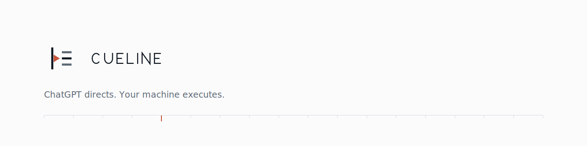
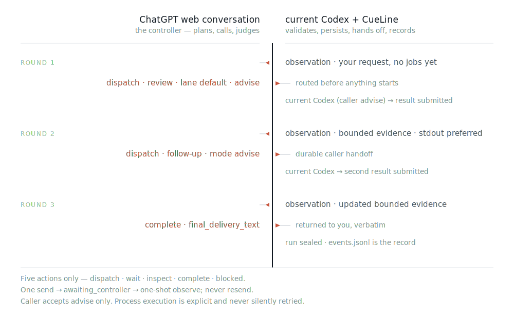

<picture>
  <source media="(prefers-color-scheme: dark)" srcset="docs/assets/cueline-banner-dark.svg">
  
</picture>

<p align="center">
  <a href="https://github.com/Seraphim0916/cueline/actions/workflows/ci.yml"></a>
</p>

<p align="center">
  <b>English</b> · <a href="README.zh-TW.md">繁體中文</a> · <a href="README.zh-CN.md">简体中文</a> · <a href="README.ja.md">日本語</a> · <a href="README.ko.md">한국어</a>
</p>

**CueLine hands the wheel to an open ChatGPT web conversation: it plans the run and calls each next step, while CueLine checks every text command and the current Codex does the permitted local work.**

The web page never touches your machine and has no local tools. It only emits one text command per round. CueLine decides whether that command is well-formed and belongs to this run. By default, it persists caller jobs for the current Codex: `advise` is a coordination-only handoff, while `work` requires a durable claim and start before any mutation. An explicitly double-authorized process executor can instead run registered local workers. CueLine keeps bounded controller evidence and the full local record.

CueLine is a standalone implementation with **no runtime npm dependencies**. It is not a wrapper around Omnilane or GPT Relay.

## Latest release: 0.1.6

- Added durable caller `work` claim/start/heartbeat/result fencing, with safe reclaim before start and `ambiguous` settlement after side effects may have begun.
- Fixed hidden `Stop answering` detection, inspected-output priority, stale read-only observation recovery, process double authorization, and process status observability.
- Hardened the bundled process route with `--ignore-user-config` and protected model/provider status from later untrusted-output spoofing.
- Verified 267/267 tests, clean package installation, and a terminal `complete` verdict from a new real ChatGPT Web Pro run without resend or interruption.

Read the complete [changelog](CHANGELOG.md#016---2026-07-15) or the immutable [v0.1.6 release](https://github.com/Seraphim0916/cueline/releases/tag/v0.1.6).

## How a run actually goes



Each round: CueLine writes down what it is about to ask, sends one observation into the conversation, and later reads back exactly one `<CueLineControl>` envelope. The controller picks one of five actions — `dispatch`, `wait`, `inspect`, `complete`, `blocked` — and nothing outside that envelope is ever executed. A command that names the wrong run, the wrong round, or a malformed job is sent back for a bounded repair attempt rather than guessed at. The loop pauses at `awaiting_controller` after one durable send, at a caller handoff, or stops at `complete`, `blocked`, or the round limit (12 by default).

A non-default `maxRounds` is fixed when the run is created and counts total controller rounds across every ownerless pause. Later continuations normally omit it and reuse the durable value; supplying a different value is rejected rather than silently resetting or widening the budget.

`caller` is the default executor for both `startCueLineRun` and `runCueLine`. With the built-in browser, CueLine submits once, captures the exact conversation URL, returns `awaiting_controller`, and releases the runtime lease instead of holding one tool call open while Pro thinks. A later `continueCueLineRun` performs one read-only observation: unfinished work returns `awaiting_controller` again without resending. A dispatch produces durable pending jobs. `advise` returns `awaiting_caller`; it has no side-effect claim, so coordinate one session. `work` returns `awaiting_caller_work` and remains unstarted until the current Codex calls `claimCueLineCallerJob` and `startCueLineCallerJob`. The claim is bound to run, job, task hash, absolute workdir, caller identity, and a fencing token. Started work is never automatically retried; an expired started claim becomes `ambiguous`. ChatGPT proposed and reviewed the work—it did not use local tools or perform the work itself.

Process execution requires both `executor: "process"` and `allowProcessExecution: true`; a non-terminal continuation must pass the second authorization again. The bundled route also uses `--ignore-user-config`, preventing hidden workers from loading user-configured MCP servers or their command arguments. The controller chooses *what should happen* and the local side chooses *whether and how it may happen*: the lane must be enabled, the candidate must be available **before** anything spawns, and `argv[0]` must already be registered by your routing config. Nothing is passed through a shell. Independent advice defaults to two concurrent jobs globally and per lane; a batch containing `work` is serial. Once a worker starts, there is no silent fallback to a second candidate. Status exposes the resolved runner, PID, phase, last progress time, and safely observed model/provider metadata.

The controller protocol keeps routing levels explicit: `lane` names the lane (`default`), while `codex-default` is a candidate runner inside that lane, not a lane. CueLine validates the entire `dispatch` before registering any job; an invalid lane or runner rejects the whole dispatch for repair, so no valid-looking subset starts early.

That process route is an allow-list, not a sandbox. A registered worker runs with the same permissions as the CueLine process itself; `advise` maps to a read-only Codex sandbox and `work` to `workspace-write`, but what you register is what you have authorized.

## The controller must be a Pro model

CueLine refuses to send unless the composer's model selector reads `Pro`. If the conversation sits on another model, CueLine switches the composer to `Pro` first — that is the only model switch it is allowed to make. In a verified live run it switched Instant to Pro and the reply came back as `gpt-5-6-pro`.

Selecting is not the same as proving. After each response CueLine reads the completed assistant message's model slug and requires it to be a Pro slug, so a downgrade between send and reply is caught rather than trusted. A failure surfaces as `MODEL_SELECTOR_MISSING`, `PRO_MODEL_UNAVAILABLE`, `PRO_MODEL_SELECTION_FAILED`, or `PRO_MODEL_MISMATCH` — never as an accepted answer.

A ChatGPT Pro subscription and the selected Pro model are two different things. An account or profile label containing `Pro` is subscription evidence only and never counts as model evidence; only the response's model slug does. Every live turn persists `controller_response_received` with `selected_model_label`, `response_model_slug`, and `model_evidence_source`, so which evidence proved the model stays auditable afterwards.

## Quick start

You need Node.js 22+, Codex with its built-in Browser, and — for the bundled default lane — the `codex` CLI on `PATH`.

Install from the npm registry:

```bash
npm install -g cueline@0.1.6
cueline install
cueline doctor
```

As a fallback, install the packaged tarball from the [v0.1.6 release](https://github.com/Seraphim0916/cueline/releases/tag/v0.1.6), which also carries its `.sha256` checksum:

```bash
npm install -g https://github.com/Seraphim0916/cueline/releases/download/v0.1.6/cueline-0.1.6.tgz
cueline install
cueline doctor
```

`cueline install` creates one symlink, the bundled skill at `$CODEX_HOME/skills/cueline` (`~/.codex/skills/cueline` by default). It refuses to replace a path it does not own, and running it twice is a no-op. `cueline uninstall` removes that link and nothing else; a foreign path in its place is preserved, not deleted.

### Install from source

```bash
git clone https://github.com/Seraphim0916/cueline.git
cd cueline
npm ci
npm run build
./install.sh      # symlinks ~/.codex/skills/cueline and ~/.local/bin/cueline
cueline doctor
```

`install.sh` creates those two symlinks and nothing else; it refuses to overwrite a path it does not own, and `./install.sh --uninstall` removes only its own links.

Then, in Codex:

1. Open `https://chatgpt.com` in Codex's built-in Browser and sign in.
2. Leave the conversation you want to be in charge selected — that page is the controller. Its composer must be on a `Pro` model; CueLine selects `Pro` for you if it is not, and refuses to send otherwise.
3. Ask Codex to use CueLine for the task: *"Use CueLine and let the open ChatGPT Pro conversation direct this task."*
4. Keep the returned `runId`. It is how an interrupted run is resumed.

The bundled `cueline` skill drives the package from Codex's own Node runtime, which is where the in-app Browser object lives. A plain `node` process started on the side does not inherit it.

## Driving it from code

```js
import {
  claimCueLineCallerJob,
  continueCueLineRun,
  createCodexIabAdapter,
  heartbeatCueLineCallerJob,
  runCueLine,
  startCueLineCallerJob,
  submitCueLineCallerJobResult,
} from "cueline";

let result = await runCueLine({
  request: "Inspect the repository, delegate an implementation plan, and report the evidence.",
  browser: createCodexIabAdapter({ browser: globalThis.browser }),
  // Optional: conversationUrl, routingConfig / routingConfigPath, home, cwd,
  // runTimeoutMs, signal, and per-job/default limits.
}); // defaults to executor: "caller"

while (["awaiting_controller", "awaiting_caller", "awaiting_caller_work"].includes(result.status)) {
  if (result.status === "awaiting_controller") {
    await waitBeforeNextObservation(); // bounded backoff; never resend
  } else if (result.status === "awaiting_caller") {
    for (const job of result.pendingJobs ?? []) {
      const stdout = await executeExactLocalAdvice(job.spec.task);
      await submitCueLineCallerJobResult(result.runId, job.jobId, {
        status: "succeeded",
        stdout,
      });
    }
  } else {
    for (const job of result.pendingJobs ?? []) {
      if (job.spec.mode !== "work") continue;
      const claim = await claimCueLineCallerJob(result.runId, job.jobId, {
        callerId: "stable-codex-task-identity",
      });
      const proof = {
        claimId: claim.claimId,
        callerId: claim.callerId,
        fencingToken: claim.fencingToken,
      };
      await startCueLineCallerJob(result.runId, job.jobId, proof);
      const stdout = await executeExactLocalWork(job.spec.task, claim.workdir, {
        heartbeat: () => heartbeatCueLineCallerJob(result.runId, job.jobId, proof),
      });
      await submitCueLineCallerJobResult(
        result.runId,
        job.jobId,
        { status: "succeeded", stdout },
        { claim: proof },
      );
    }
  }
  result = await continueCueLineRun({ runId: result.runId });
}

if (result.status === "complete") {
  console.log(result.finalDeliveryText);
}
```

`startCueLineRun` creates the durable run and returns `ready` without driving the browser. `runCueLine` creates and advances it to a durable controller-observation pause, caller handoff, or terminal state. `continueCueLineRun({ runId })` advances the same conversation and reuses its stored URL. `loadCueLineRunState(runId)` is read-only. A terminal run is returned as-is. Before continuation, run `cueline run status <run-id> --json`: `controller_response_pending` with exactly one normally submitted turn and `safeNextAction: observe` means Pro's response has not yet been observed; wait briefly and continue it without resend. That exact read-only observer can be safely fenced even after its lease becomes stale, but ambiguous/manual submissions, jobs, pending commands, cancellation, or a missing/mismatched URL still require explicit recovery. `phase: prompt_not_sent` with `safeNextAction: retry` is used only with write-ahead or request-correlated `definitely_not_sent` evidence. Caller work phases report `claim_caller_work`, `start_caller_work`, or `continue_caller_work`; a dispatch alone is not local execution. An accepted response plus `jobs_running` means a double-authorized process executor is active. CLI status output is an explicit metadata allowlist: it omits task bodies, caller identities, task hashes, workdirs, and runtime owner IDs. The formal caller claim API returns the exact task and workdir to the authorized caller; the detailed read-only API remains available for trusted local diagnostics.

`listCueLineRuns()` is a read-only, sanitized inventory for discovering persisted run IDs. It omits controller text, conversation URLs, job tasks, and worker output.

`verifyCueLineRun(runId)` is a read-only integrity check for the creation marker, event replay and authority fences, optional snapshot, runtime lease, and job status evidence. It returns stable findings without returning durable run content.

Inside Codex's runtime, import the absolute module that `cueline api path` prints — that is the built API of the package you installed.

## The CLI

The CLI does not drive the browser. `doctor`, `routing`, `jobs`, `runs`, `run status`, `run verify`, `api path`, and `config path` are read-only. `install`/`uninstall` change the package-owned skill link. `run reconcile`, `run takeover`, `run reconcile-runtime`, `run cancel`/`run stop`, and `job cancel` append evidence or change durable local run/job state. Run `cueline help` for every positional argument and option before using a state-changing command.

```console
$ cueline install
CueLine skill installed: /Users/you/.codex/skills/cueline

$ cueline doctor
CueLine 0.1.6
status	ok
node	22.14.0	ok
config	/usr/local/lib/node_modules/cueline/config/routing.default.json	valid
home	/Users/you/.cueline
caller_ready	yes
caller_lanes	1
process_available_lanes	1

$ cueline doctor --json
{"version":"0.1.6","status":"ok","node":{"version":"22.14.0","ok":true,"requirement":">=22"},...}

$ cueline api path
/usr/local/lib/node_modules/cueline/dist/src/api.js

$ cueline routing
default	codex-default	available

$ cueline routing --json
{"version":"0.1.6","availableLanes":1,"lanes":[{"name":"default","status":"available","selectedRunnerId":"codex-default"}],...}

$ cueline jobs
No jobs.

$ cueline protocol lint response.txt --run-id run_... --round 3 --request-id msg_... --json
{"valid":false,"issues":[{"code":"LEGACY_RUNNER_ID_FIELD",...}]}

$ cueline runs
No runs.

$ cueline run status run_... --json
{"status":"running","executor":"caller","phase":"caller_jobs_pending","runtime":{"ownership":"missing"},...}

$ cueline run doctor run_... --json
{"outcome":"action_required","phase":"caller_jobs_pending","nextAction":"execute_caller_jobs",...}

$ cueline run watch run_... --after 42 --timeout-ms 5000 --json
{"outcome":"changed","previousSequence":42,"currentSequence":43,...}

$ cueline run handoff run_... --json
{"schema":"cueline-handoff/0.1","run":{"runId":"run_...","safeNextAction":"execute_caller_jobs"},...}

$ cueline run timeline run_... --after 40 --limit 20 --json
{"schema":"cueline-timeline/0.1","entries":[{"sequence":41,"type":"job_status",...}],...}

$ cueline run verify run_... --json
{"runId":"run_...","outcome":"verified","marker":"valid",...}

$ cueline run takeover stale_run_... --json
{"runId":"stale_run_...","outcome":"taken_over","next":"continue",...}

$ cueline run reconcile run_... --request-id msg_... --manual-send-confirmed --conversation-url https://chatgpt.com/c/...
run_...\tmsg_...\tconfirmed

$ cueline run cancel run_...
run_...	requested	affected_jobs=0

$ cueline config path
/usr/local/lib/node_modules/cueline/config/routing.default.json

$ cueline uninstall
CueLine skill removed: /Users/you/.codex/skills/cueline
```

`cueline doctor` exits non-zero when Node is too old or no enabled caller lane exists. `process_available_lanes` may be zero without degrading caller mode; use `cueline routing` to inspect process availability before explicitly selecting that executor. `cueline api path` is what the skill imports, so a packaged install needs no repository checkout. `cueline help` lists every command's exact syntax, including `--json` and the manual-reconcile confirmation flags.

The experimental `run doctor` command converts a run snapshot into stable
finding codes, bounded evidence, and a safe next action without writing state.
See [`docs/experiments/run-doctor.md`](docs/experiments/run-doctor.md).

The experimental `run watch` command performs a bounded, lease-free observation
using the durable event sequence as its cursor. See
[`docs/experiments/run-watch.md`](docs/experiments/run-watch.md).

The experimental `protocol lint` command validates a Pro envelope offline and
reports all known contract corrections in one pass. See
[`docs/experiments/protocol-lint.md`](docs/experiments/protocol-lint.md).

The experimental `run handoff` command produces a safe restart packet with
exact identities and absolute paths. See
[`docs/experiments/run-handoff.md`](docs/experiments/run-handoff.md).

The experimental `run timeline` command exposes a sanitized, cursor-paginated
audit view without raw event payloads. See
[`docs/experiments/run-timeline.md`](docs/experiments/run-timeline.md).

Use `run takeover` only when `run status` reports an exact stale owner. It refuses a fresh active heartbeat and returns `next: continue` or `next: reconcile_runtime`; follow that value instead of guessing.

## Configuration

`CUELINE_CONFIG` selects a routing file; `CUELINE_HOME` moves local state (default `~/.cueline`).

Caller execution needs no spawned route. When `executor: "process"` and `allowProcessExecution: true` are both selected, the bundled `default` lane holds one candidate, `codex-default`: isolated `codex exec --ignore-user-config` with the task on stdin, `read-only` for `advise`, and `workspace-write` for `work`. To register a different process worker, copy [`config/routing.default.json`](config/routing.default.json), add your candidate, and point `CUELINE_CONFIG` at it.

State lives under `CUELINE_HOME`:

```text
runs/<run-id>/events.jsonl + events.jsonl.segments/   append-only, authoritative
runs/<run-id>/runtime.json.fence + runtime.json.epochs/   fenced live-owner heartbeat evidence
runs/<run-id>/runtime.json.retired-owners/   immutable stale-owner event cutoffs
runs/<run-id>/runtime.json.takeover-intents/   immutable exact takeover attempts
runs/<run-id>/cancel.json    durable cancellation request, when present
runs/<run-id>/snapshot.json   a replay optimization, disposable
jobs/<job-id>.json            per-job execution evidence
```

The event log is the record: the controller turn is written before it is sent, and a job is registered before its process starts, so an interruption between intent and side effect leaves a trace. A corrupt snapshot is ignored and rebuilt from event 1 rather than trusted.

Recovery reattaches only to the exact recorded conversation URL. CueLine recognizes long prompts that ChatGPT automatically converts into attachment chips and makes at most one send attempt. Contenteditable block newlines are normalized before readiness comparison. An ambiguous click is `possibly_sent` and is never clicked again. A response is considered in progress only while a visible, enabled, actionable Stop control exists; hidden residual buttons do not suppress a completed Pro response. If an operator manually sends an attachment after ChatGPT creates the first `/c/...` URL, `cueline run reconcile ... --manual-send-confirmed --conversation-url URL` atomically binds the exact URL and records an append-only confirmation; CueLine then requires exact conversation, Pro model, and protocol/run/round/request identity before importing the response without resend or duplicate dispatch.

Never interrupt Pro or use `Answer now`, `Respond now`, `Stop`, or an equivalent acceleration control while it is answering. Pro has no local tools and no default knowledge of repository layout or local paths. Caller evidence must include exact code/error identifiers, relevant code excerpts, and absolute local paths, then explicitly ask whether Pro needs more local evidence.

Controller observations prefer successful non-empty stdout, retain full stdout/stderr in local job status, and share one 12,000-character evidence budget with an explicit truncation marker. Every preferred output/error field includes a raw-character `evidence_window` and SHA-256 `content_hash`. When `next_offset` is non-null, Pro can inspect exactly one job by copying it as `evidence_offset` and the hash as `evidence_hash`; CueLine returns the next bounded window without rerunning the job. Changed evidence invalidates the cursor instead of mixing versions. An accepted `inspect(job_ids)` reserves that budget for the named jobs before unrelated evidence, so the next Pro turn receives the requested output instead of only its terminal status. `wait` and `inspect` targets must be exact job IDs from the current observation; one unknown target rejects the entire command for repair before any partial wait or inspection. Controller commands are exact per action: unknown top-level fields, fields belonging to another action, empty/duplicate/malformed `job_ids`, `prompt` in place of `task`, and `runner_id` in place of `runner` are rejected with a repair error instead of silently ignored.

## Verify

```bash
npm ci
npm run typecheck
npm test
npm run smoke:fake
bash test/shell/install.test.sh
npm pack --dry-run
```

`npm run smoke:fake` exercises the whole controller loop against a fake browser and fake runner, offline. It proves the loop, not the live page — only a real completed turn through the in-app Browser proves that.

## Limits in 0.1

Text commands only. One conversation per run. Selecting `Pro` is the only model switch CueLine makes. Automatic long-text-to-attachment conversion is supported, but deliberate file upload, images, Deep Research, Projects, and Apps are not. Caller `work` requires an explicit durable claim/start and a heartbeat for long work; process execution requires two explicit authorization fields. No automatic retry or fallback starts work twice. macOS is the primary desktop target and Linux is the CI target; Windows is unverified. The adapter depends on the current ChatGPT web UI, so a UI change surfaces explicitly, never as a fabricated answer.

See [compatibility](docs/compatibility.md) for the full matrix.

## Docs

[architecture](docs/architecture.md) · [controller protocol](docs/controller-protocol.md) · [runner contract](docs/runner-contract.md) · [state and recovery](docs/state-and-recovery.md) · [compatibility](docs/compatibility.md) · [provenance](docs/provenance.md)

## Development

TypeScript, ESM, Node built-ins only. `npm run build` compiles to `dist/`; tests run on the compiled output with `node --test`. CI covers Node 22 and 24 on Ubuntu and macOS.

CueLine is an independent project and is not affiliated with, endorsed by, or sponsored by OpenAI or any other company. See [provenance](docs/provenance.md) and [third-party notices](THIRD_PARTY_NOTICES.md).

## License

MIT. See [LICENSE](LICENSE).
