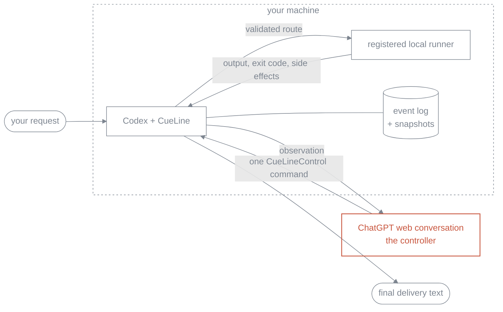

<picture>
  <source media="(prefers-color-scheme: dark)" srcset="docs/assets/cueline-banner-dark.svg">
  
</picture>

[](https://github.com/Seraphim0916/cueline/actions/workflows/ci.yml)

**CueLine hands the wheel to an open ChatGPT web conversation: it plans the run and calls each next step, while CueLine checks every command and does the actual work here, on your machine.**

The web page never touches your machine. It only ever emits one small text command per round. CueLine decides whether that command is well-formed, whether it belongs to this run, which local worker it maps to — and then runs it, keeps the evidence, and hands the evidence back.

CueLine is a standalone implementation with **no runtime npm dependencies**. It is not a wrapper around Omnilane or GPT Relay.

## How a run actually goes



Each round: CueLine writes down what it is about to ask, sends one observation into the conversation, and reads back exactly one `<CueLineControl>` envelope. The controller picks one of five actions — `dispatch`, `wait`, `inspect`, `complete`, `blocked` — and nothing outside that envelope is ever executed. A command that names the wrong run, the wrong round, or a malformed job is sent back for a bounded repair attempt rather than guessed at. The loop stops at `complete` or `blocked`, or when it runs out of rounds (12 by default).

The controller chooses *what should happen*. The local side chooses *whether and how it may happen*: the lane must be enabled, the candidate must be available **before** anything spawns, and `argv[0]` must already be registered by your routing config. Nothing is passed through a shell. Once a worker starts, there is no silent fallback to a second candidate — a failure comes back as evidence, not as a retry.

That is an allow-list, not a sandbox. A registered worker runs with the same permissions as the CueLine process itself; `advise` maps to a read-only Codex sandbox and `work` to `workspace-write`, but what you register is what you have authorized.

## Quick start

You need Node.js 22+, Codex with its built-in Browser, and — for the bundled default lane — the `codex` CLI on `PATH`.

```bash
git clone https://github.com/Seraphim0916/cueline.git
cd cueline
npm ci
npm run build
./install.sh      # symlinks ~/.codex/skills/cueline and ~/.local/bin/cueline
cueline doctor
```

`install.sh` creates those two symlinks and nothing else; it refuses to overwrite a path it does not own, and `./install.sh --uninstall` removes only its own links.

Then, in Codex:

1. Open `https://chatgpt.com` in Codex's built-in Browser and sign in.
2. Leave the conversation you want to be in charge selected — that page's current model is the controller. CueLine does not switch models and does not check your plan.
3. Ask Codex to use CueLine for the task: *"Use CueLine: review this repository and propose the next change, with evidence."*
4. Keep the returned `runId`. It is how an interrupted run is resumed.

The bundled `cueline` skill drives the package from Codex's own Node runtime, which is where the in-app Browser object lives. A plain `node` process started on the side does not inherit it.

## Driving it from code

```js
import { createCodexIabAdapter, runCueLine } from "cueline";

const result = await runCueLine({
  request: "Inspect the repository, delegate an implementation plan, and report the evidence.",
  browser: createCodexIabAdapter(),
  // Optional: conversationUrl, routingConfig / routingConfigPath, home, cwd, limits.
});

if (result.status === "complete") {
  console.log(result.finalDeliveryText);
}
```

`startCueLineRun` is the explicit start (`runCueLine` is its alias). `continueCueLineRun({ runId })` resumes an interrupted run in the same conversation, and reuses the stored conversation URL unless you hand it a new adapter. `loadCueLineRunState(runId)` reads persisted state without driving anything. A run that already reached `complete` or `blocked` is returned as-is, never dispatched twice.

## The CLI

The CLI does not drive the browser. It tells you whether the local half is sound.

```console
$ cueline doctor
CueLine 0.1.0
status	ok
node	22.14.0	ok
config	/Users/you/cueline/config/routing.default.json	valid
home	/Users/you/.cueline
available_lanes	1

$ cueline routing
default	codex-default	available

$ cueline jobs
No jobs.

$ cueline config path
/Users/you/cueline/config/routing.default.json
```

`cueline doctor` exits non-zero when Node is too old or no lane can resolve, which makes it usable as a preflight check. `cueline routing` shows why a lane is unavailable instead of quietly selecting something else. `cueline help` lists everything.

## Configuration

`CUELINE_CONFIG` selects a routing file; `CUELINE_HOME` moves local state (default `~/.cueline`).

The bundled `default` lane holds one candidate, `codex-default`: `codex exec` with the task on stdin, `read-only` for `advise`, `workspace-write` for `work`. To register a different worker, copy [`config/routing.default.json`](config/routing.default.json), add your candidate, and point `CUELINE_CONFIG` at it — the executable in `argv[0]` becomes registered by that act, and must also be on `PATH` before a lane resolves.

State lives under `CUELINE_HOME`:

```text
runs/<run-id>/events.jsonl    append-only, authoritative
runs/<run-id>/snapshot.json   a replay optimization, disposable
jobs/<job-id>.json            per-job execution evidence
```

The event log is the record: the controller turn is written before it is sent, and a job is registered before its process starts, so an interruption between intent and side effect leaves a trace. A corrupt snapshot is ignored and rebuilt from event 1 rather than trusted.

## Verify

```bash
npm ci
npm run typecheck
npm test
npm run smoke:fake
bash test/shell/install.test.sh
npm pack --dry-run
```

`npm run smoke:fake` exercises the whole controller loop against a fake browser and fake runner, offline. It proves the loop, not the live page — only a real completed turn through the in-app Browser proves that.

## Limits in 0.1

Text only. One conversation per run. No model switching, no images, no file upload, no Deep Research, Projects, or Apps. No automatic retry or fallback once a worker has started — a failed `work` job is reported with its side effects flagged as ambiguous, because CueLine cannot prove how far it got. macOS is the primary desktop target and Linux is the CI target; Windows is unverified, and `install.sh` is not a Windows installer. The adapter depends on the current ChatGPT web UI, so a UI change surfaces as an explicit `COMPOSER_MISSING`, `SEND_BUTTON_MISSING`, or response timeout — never as a fabricated answer.

See [compatibility](docs/compatibility.md) for the full matrix.

## Docs

[architecture](docs/architecture.md) · [controller protocol](docs/controller-protocol.md) · [runner contract](docs/runner-contract.md) · [state and recovery](docs/state-and-recovery.md) · [compatibility](docs/compatibility.md) · [provenance](docs/provenance.md)

## Development

TypeScript, ESM, Node built-ins only. `npm run build` compiles to `dist/`; tests run on the compiled output with `node --test`. CI covers Node 22 and 24 on Ubuntu and macOS.

CueLine is an independent project and is not affiliated with, endorsed by, or sponsored by OpenAI or any other company. See [provenance](docs/provenance.md) and [third-party notices](THIRD_PARTY_NOTICES.md).

## License

MIT. See [LICENSE](LICENSE).
