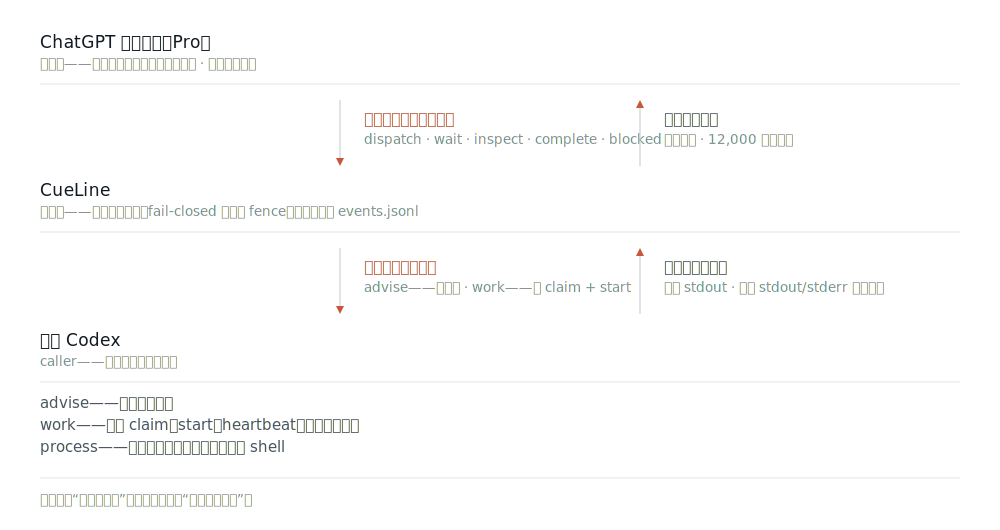
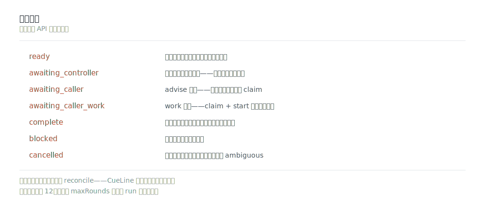

<picture>
  <source media="(prefers-color-scheme: dark)" srcset="docs/assets/cueline-banner-dark.svg">
  
</picture>

<p align="center">
  <a href="https://github.com/Seraphim0916/cueline/actions/workflows/ci.yml"></a>
  <a href="https://www.npmjs.com/package/cueline"></a>
  <a href="package.json"></a>
  <a href="LICENSE"></a>
</p>

<p align="center">
  <a href="README.md">English</a> · <a href="README.zh-TW.md">繁體中文</a> · <b>简体中文</b> · <a href="README.ja.md">日本語</a> · <a href="README.ko.md">한국어</a>
</p>

**CueLine 把方向盘交给一个已经打开的 ChatGPT 网页会话：由它规划运行、发出每一步文本指令；CueLine 负责校验，当前 Codex 才在本机执行获准的工作。**

**它为何存在。** 让 AI 在你的机器上动手，通常等于交出不受限的 shell 权限。CueLine 拿掉这个取舍：网页那端只能发文本，CueLine 在任何东西执行前，先用 fail-closed 边界与授权校验每一条指令，且每个动作都留有记录。

**用一个例子说。** 打开一个 ChatGPT 会话，让它跑你的测试或重构某个模块。它每一轮发出一条指令；CueLine 逐一校验、强制资源上限，只有获准的工作才在本机执行——不会有盲目的 `rm -rf`、不会有失控循环，还有可供审计的完整运行记录。

那个网页碰不到你的机器，也没有本地工具。它每一轮只发出一条文本控制指令。CueLine 默认把 caller 作业持久化：`advise` 是协调式交接；`work` 必须先获得持久 claim 并正式 start。只有双重显式授权 `process` executor，才会启动已注册的本地 worker。



CueLine 是独立实现，**没有任何运行时 npm 依赖**，也不是 Omnilane 的包装层。

## 最新版本：0.6.3

- ChatGPT 发送流程现在会在历史消息数不可读时于点击前 fail-closed，同时永久记录精确的点击前目标，并且每次尝试只允许一个 Send 动作。持久的一次性恢复会沿用同一轮和 request 身份。只要已有永久 submitted 证据，完全匹配的 Pro 回复就能优先于过期的 not-sent 证据被接收，不会重复发送或建立新一轮；715/715 测试通过。

完整内容请查看 [changelog](CHANGELOG.md#061---2026-07-22) 或版本化的 [v0.6.3 release](https://github.com/Seraphim0916/cueline/releases/tag/v0.6.3)。

## 一次运行实际是怎么走的


每一轮：CueLine 先把“接下来要问什么”写入记录，向会话发送一份观测（observation），之后再读回**恰好一个** `<CueLineControl>` 信封。控制器从五个动作中选一个——`dispatch`、`wait`、`inspect`、`complete`、`blocked`——信封之外的任何文本都不会被执行。循环会在一次可靠发送后以 `awaiting_controller` 暂停，也会停在 caller 交接、`complete`、`blocked` 或轮次上限（默认 12 轮）。

控制器命令还有 fail-closed 资源上限：每个信封 131,072 字符、每次 dispatch 最多 64 个作业、每次 wait 或 inspect 最多 256 个显式 job ID。这些检查发生在注册作业或启动进程之前。

非默认的 `maxRounds` 会在创建 run 时固定，并跨所有无 owner 的暂停累计控制器总轮次。后续继续通常省略它并复用持久值；传入不同数值会被拒绝，不会暗中重置或放宽预算。

`startCueLineRun` 与 `runCueLine` 都默认使用 `caller`。CueLine 发送一次后返回 `awaiting_controller` 并释放 lease；继续只做一次只读观测，绝不重发。`advise` 返回 `awaiting_caller`，没有副作用 claim；`work` 返回 `awaiting_caller_work`，必须由当前 Codex 调用 `claimCueLineCallerJob` 与 `startCueLineCallerJob` 后才能修改。claim 绑定 run、job、task hash、绝对 workdir、caller identity 与 fencing token；已开始的工作不会自动重试，过期后成为 `ambiguous`。Pro 只提出和审查文本指令，不会使用本地工具。

Process 模式必须同时指定 `executor: "process"` 与 `allowProcessExecution: true`，非终态继续也要再次传入第二道授权。内置 route 还使用 `--ignore-user-config`，不会让隐藏 worker 加载用户配置的 MCP server 或其命令参数。通道必须启用、候选必须在任何进程启动**之前**确认可用、`argv[0]` 必须已注册。没有内容经过 shell，也不会在启动后自动换候选。

控制器协议有意区分路由层级：`lane` 填的是通道名称 `default`；`codex-default` 是该通道内的候选执行器，不是通道。CueLine 会在注册任何作业之前先验证整份 `dispatch`；只要包含无效通道或执行器，整份派工就会被退回修复，不会先执行其中一部分。

这是白名单（allow-list），不是沙箱。已注册的 worker 拥有与 CueLine 进程本身相同的权限；`advise` 对应 Codex 的只读沙箱、`work` 对应 `workspace-write`，但你注册了什么，就等于你授权了什么。

## 运行状态



`cueline run status <run-id> --json` 报告持久状态和 `safeNextAction`；`cueline run doctor <run-id> --json` 把同一份快照转成稳定的 finding 代码和一个安全的下一步。任何模糊情形——可能已发送的点击、过期的已启动 claim、人工附件发送——CueLine 都会停下来要求显式 reconcile，而不是重发。完整恢复契约见 [state and recovery](docs/state-and-recovery.md)。

## 控制器必须是 Pro 模型

除非输入框的模型选择器显示 `Pro`，否则 CueLine 拒绝发送。会话若停在别的模型，CueLine 会先把输入框切换到 `Pro`——这是它唯一被允许做的模型切换。在一次已验证的实机运行中，它把 Instant 切换为 Pro，返回的响应是 `gpt-5-6-pro`。

选中不等于证明。每次响应之后，CueLine 会读取该条已完成助手消息的模型 slug，并要求它是 Pro 的 slug；发送与回复之间若发生降级，会被抓出来，而不是被信任。失败会以 `MODEL_SELECTOR_MISSING`、`PRO_MODEL_UNAVAILABLE`、`PRO_MODEL_SELECTION_FAILED` 或 `PRO_MODEL_MISMATCH` 暴露出来——绝不会变成一个被接受的答案。

ChatGPT Pro 订阅套餐与“选定的 Pro 模型”是两回事。账号或个人资料标签上出现 `Pro`，只是订阅套餐的证据，永远不算模型证据；只有响应的模型 slug 才算。每一轮实机回合都会持久化 `controller_response_received`，携带 `selected_model_label`、`response_model_slug` 与 `model_evidence_source`，因此“是哪一种证据证明了模型”事后依然可审计。

## 五分钟上手

你需要 Node.js 22 以上、带内置浏览器的 Codex，以及——若使用内置的默认通道——`PATH` 上有 `codex` CLI。

从 npm registry 安装：

```bash
npm install -g cueline@0.6.3
cueline install
cueline doctor
```

作为后备，也可以安装 [v0.6.3 release](https://github.com/Seraphim0916/cueline/releases/tag/v0.6.3) 上的打包 tarball，该 release 同时附带它的 `.sha256` 校验值：

```bash
npm install -g https://github.com/Seraphim0916/cueline/releases/download/v0.6.3/cueline-0.6.3.tgz
cueline install
cueline doctor
```

`cueline install` 只创建一个软链接：把内置的 skill 接到 `$CODEX_HOME/skills/cueline`（默认 `~/.codex/skills/cueline`）。它拒绝覆盖不属于自己的路径，重复执行也不会产生副作用。`cueline uninstall` 只移除那一个链接；若该位置换成了别人的文件，它会保留而不删除。

### 从源码安装

```bash
git clone https://github.com/Seraphim0916/cueline.git
cd cueline
npm ci
npm run build
./install.sh      # 创建 ~/.codex/skills/cueline 与 ~/.local/bin/cueline 两个软链接
cueline doctor
```

`install.sh` 只创建这两个软链接，不做别的；它拒绝覆盖不属于自己的路径，而 `./install.sh --uninstall` 也只移除自己创建的链接。

然后，在 Codex 里：

1. 用 Codex 的内置浏览器打开 `https://chatgpt.com` 并登录。
2. 让你想让它当控制器的那个会话保持选中——该页面就是控制器。若没有已选中的标签页、且同时存在多个匹配的 ChatGPT 标签页，CueLine 会返回 `IAB_CHATGPT_TAB_AMBIGUOUS`，而不是擅自挑第一个。它的输入框必须停在 `Pro` 模型；若不是，CueLine 会替你选成 `Pro`，否则就拒绝发送。
3. 让 Codex 用 CueLine 处理任务：*“用 CueLine，让那个打开的 ChatGPT Pro 会话来指挥这项任务。”*
4. 保留返回的 `runId`。被中断的运行要续跑，就靠它。

内置的 `cueline` skill 是从 Codex 自身的 Node runtime 驱动这个包的——内置浏览器对象就存在于那里。另外单独启动的 `node` 进程不会继承它。

## 从代码驱动

```js
import {
  claimCueLineCallerJob,
  continueCueLineRun,
  createCodexIabAdapter,
  heartbeatCueLineCallerJob,
  runCueLine,
  startCueLineCallerJob,
  submitCueLineCallerJobResult,
} from "cueline";

let result = await runCueLine({
  request: "Inspect the repository, delegate an implementation plan, and report the evidence.",
  browser: createCodexIabAdapter({ browser: globalThis.browser }),
  // 可选并显式启用：archiveControllerConversationOnComplete: true,
  // 可选：conversationUrl、routingConfig / routingConfigPath、home、cwd、
  // runTimeoutMs、signal，以及作业/默认期限。
}); // 默认 executor: "caller"

while (["awaiting_controller", "awaiting_caller", "awaiting_caller_work"].includes(result.status)) {
  if (result.status === "awaiting_controller") {
    await waitBeforeNextObservation(); // 有界退避；绝不重发
  } else if (result.status === "awaiting_caller") {
    for (const job of result.pendingJobs ?? []) {
      const stdout = await executeExactLocalAdvice(job.spec.task);
      await submitCueLineCallerJobResult(result.runId, job.jobId, {
        status: "succeeded",
        stdout,
      });
    }
  } else {
    for (const job of result.pendingJobs ?? []) {
      if (job.spec.mode !== "work") continue;
      const claim = await claimCueLineCallerJob(result.runId, job.jobId, {
        callerId: "stable-codex-task-identity",
      });
      const proof = { claimId: claim.claimId, callerId: claim.callerId, fencingToken: claim.fencingToken };
      await startCueLineCallerJob(result.runId, job.jobId, proof);
      const stdout = await executeExactLocalWork(job.spec.task, claim.resolvedWorkdir, {
        heartbeat: () => heartbeatCueLineCallerJob(result.runId, job.jobId, proof),
      });
      await submitCueLineCallerJobResult(result.runId, job.jobId, { status: "succeeded", stdout }, { claim: proof });
    }
  }
  result = await continueCueLineRun({ runId: result.runId });
}

if (result.status === "complete") {
  console.log(result.finalDeliveryText);
}
```

`archiveControllerConversationOnComplete` 默认为 `false`，并在创建 run 时固定。启用后，CueLine 会先把 `complete` 写入持久记录，再在 Pro 空闲时只归档那一个精确绑定的会话。点击 fence 前能证明尚未点击的失败可以重试；fence 之后只要超时、重启、页面切换或缺少完成证据，就标为 `ambiguous` 且永不再点。`blocked` 与 `cancelled` 一律保留原会话。

`awaiting_controller` 只读观测且不重发；`awaiting_caller` 交接 `advise`；`awaiting_caller_work` 必须依次 claim、start、执行、heartbeat 并带 claim proof 提交。Pro 网页从不直接使用本地工具。

`listCueLineRuns()` 是只读且已脱敏的 run 清单，可用来找回持久化的 run ID；它不包含控制器文本、会话 URL、作业内容或 worker 输出。

`verifyCueLineRun(runId)` 是只读完整性检查，会核对创建 marker、event replay 与 authority fence、可选 snapshot、runtime lease 和 job status 证据；只返回稳定 finding，不返回持久 run 内容。

`confirmManualControllerSubmission(runId, …)` 与 `confirmControllerTurnNotSent(runId, …)` 是两种 reconcile 确认的编程接口。二者都只追加事件、幂等可重复执行，也都不驱动浏览器、不重发任何内容。

在 Codex 的 runtime 里，import `cueline api path` 打印出的那个绝对路径模块——那就是你安装的那份包构建出来的 API。

`startCueLineRun` 只创建持久 run 并返回 `ready`；`runCueLine` 创建并推进到持久 controller 观测暂停、caller 交接或终态。缺少 owner 的 `controller_response_pending` 若只有一个正常发送的回合且显示 `safeNextAction: observe`，表示同一个 Pro 回复仍待只读观测；稍后继续即可且不得重发。`safeNextAction: reconcile` 只用于模糊、人工发送或多个待对账回合。缺少 owner 的 `caller_jobs_pending` 是正常本地交接，并非 orphan，也不是仍在等 ChatGPT。CLI 的 `run status` 只输出交接所需元数据，不包含 task 正文、caller 身份、task hash、workdir 或 runtime owner ID；正式 claim 后，API 才把精确 task 与 workdir 交给获授权的 caller。

## CLI

CLI 不驱动浏览器。执行写入状态的命令前，先用 `cueline help` 核对完整参数。

| 分组 | 命令 | 效果 |
| --- | --- | --- |
| 查看 | `doctor` · `routing` · `routing explain` · `jobs` · `runs` · `run status` · `run status-at` · `run diff` · `run doctor` · `run watch` · `run timeline` · `run graph` · `run verify` · `run handoff` · `protocol lint` · `api path` · `config path` | 只读 |
| 安装 | `install` · `uninstall` | 只创建或移除包所拥有的 skill 链接 |
| 恢复 | `run reconcile` · `run takeover` · `run reconcile-runtime` · `run cancel` / `run stop` · `job cancel` | 追加审计证据或修改持久 run/job 状态 |

```console
$ cueline doctor
CueLine 0.6.3
status	ok
node	22.14.0	ok
config	/usr/local/lib/node_modules/cueline/config/routing.default.json	valid
home	/Users/you/.cueline
caller_ready	yes
caller_lanes	1
process_available_lanes	1

$ cueline routing
default	codex-default	available

$ cueline run status run_... --json
{"status":"running","executor":"caller","phase":"caller_jobs_pending","runtime":{"ownership":"missing"},...}

$ cueline run doctor run_... --json
{"outcome":"action_required","phase":"caller_jobs_pending","nextAction":"execute_caller_jobs",...}

$ cueline run reconcile run_... --request-id msg_... --manual-send-confirmed --conversation-url https://chatgpt.com/c/...
run_...\tmsg_...\tconfirmed

$ cueline run cancel run_...
run_...	requested	affected_jobs=0
```

当 Node 版本过旧、或没有任何已启用的 caller 通道时，`cueline doctor` 会以非零状态退出。`process_available_lanes` 可以为 0 而不影响 caller 模式；只有显式选择 process executor 前才需要用 `cueline routing` 检查 process 可用性。`cueline api path` 打印的就是 skill 会 import 的模块，所以使用打包安装时完全不需要 clone 源码。`cueline help` 会列出每个命令的精确语法，包括 `--json` 和人工 reconcile 的必需确认参数。

0.2.0 新增的四个可观测性命令全部严格只读：`run status-at` 按单个精确事件序号重建脱敏的 run 状态——“那个时刻 CueLine 知道什么”；`run diff` 逐字段比较两份脱敏的 run 摘要，绝不含原始 prompt 或输出；`run graph` 把脱敏的 timeline 条目渲染成有界的 Mermaid 控制流图；`routing explain` 则在任何进程启动前解释通道选择、可用性与淘汰原因，不泄露 runner 参数（见 [multi-model routing](docs/multi-model-routing.md)）。

实验性的诊断命令各有专属文档：

| 命令 | 用途 | 文档 |
| --- | --- | --- |
| `run doctor` | 把 run 快照转成稳定 finding 代码、有界证据与一个安全下一步，不写入任何状态 | [run-doctor](docs/experiments/run-doctor.md) |
| `run watch` | 以持久事件序号为游标，做有界、不占 lease 的观察 | [run-watch](docs/experiments/run-watch.md) |
| `protocol lint` | 离线校验 Pro 信封，一次报告所有已知的契约修正 | [protocol-lint](docs/experiments/protocol-lint.md) |
| `run handoff` | 产出带精确身份与绝对路径的安全重启包 | [run-handoff](docs/experiments/run-handoff.md) |
| `run timeline` | 脱敏、游标分页的审计视图，不含原始事件内容 | [run-timeline](docs/experiments/run-timeline.md) |

只有 `run status` 明确显示 stale owner 时才能使用 `run takeover`。新鲜的 active heartbeat 会被拒绝；命令返回 `next: continue` 或 `next: reconcile_runtime`，请按该值行动，不要自行猜测。

## 配置

`CUELINE_CONFIG` 用于指定路由配置文件；`CUELINE_HOME` 用于迁移本地状态（默认 `~/.cueline`）。

Caller 模式不会启动路由进程。只有同时选择 `executor: "process"` 与 `allowProcessExecution: true` 时，内置 `default` 通道才以 `codex-default` 运行隔离的 `codex exec --ignore-user-config`；独立 `advise` 默认全局/每 lane 并发上限均为 2，包含 `work` 的批次保持串行。要注册不同的 process worker，复制 [`config/routing.default.json`](config/routing.default.json)、加入你的候选项，再把 `CUELINE_CONFIG` 指过去。

要注册多个对应不同模型的候选项，以及 advise 专用 wrapper 的示例，见 [multi-model routing](docs/multi-model-routing.md)。

状态位于 `CUELINE_HOME` 之下：

```text
runs/<run-id>/events.jsonl + events.jsonl.segments/   仅追加、具权威性
runs/<run-id>/runtime.json.fence + runtime.json.epochs/   带世代隔离的活跃 owner heartbeat 证据
runs/<run-id>/runtime.json.retired-owners/   不可变的旧 owner 事件截止点
runs/<run-id>/runtime.json.takeover-intents/   不可变的精确 takeover 尝试记录
runs/<run-id>/cancel.json    存在时表示持久取消请求
runs/<run-id>/snapshot.json   重放优化产物，可丢弃
jobs/<job-id>.json            每个作业的执行证据
```

事件日志才是记录本身：控制器这一轮在发送之前先写入、作业在进程启动之前先注册，因此“意图”与“副作用”之间若被中断，会留下痕迹。损坏的快照会被忽略并从第 1 号事件重建，而不是被信任。

续跑只接回完全相同的会话 URL。ChatGPT 自动把长文本转换成附件时，CueLine 识别 `attachment_ready` 且最多点击一次；模糊点击记为 `possibly_sent`，绝不补点或重发。只有实际可见、启用且可操作的 Stop 按钮才表示 Pro 仍在回答；隐藏残留按钮不会挡住已完成的回复。人工发送附件后，使用 `cueline run reconcile RUN_ID --request-id REQUEST_ID --manual-send-confirmed` 写入正式确认；仍须通过完全一致的 conversation、Pro 证据与 protocol/run/round/request identity。

相反方向的确认处理“点击确定没有送达”的情形：操作者亲自检查那个精确会话、确认消息不存在后，用 `cueline run reconcile ... --not-sent-confirmed --conversation-url URL` 以仅追加的方式放弃旧的 request 身份，并授权恰好一次同 prompt 重试（使用新的确定性 request ID）。两个标志互斥；若被放弃的消息或其回复事后仍然出现，CueLine 会冻结该 run 交由人工裁决，绝不接受或重发。

Pro 回答时绝不要打断它，也不要用 `Answer now`、`Respond now`、`Stop` 或任何等效的加速控制。Pro 没有本地工具，也不默认了解 repository 布局或本地路径。Caller 证据必须包含精确的代码/错误标识、相关代码摘录与绝对本地路径，并明确询问 Pro 是否还需要更多本地证据。

控制器证据优先使用成功且非空的 stdout，全局上限 12,000 字符；完整 stdout/stderr 保留在本地。若 Pro 接受 `inspect(job_ids)`，下一轮会先为指定 job 保留证据预算，再处理无关作业。

## 验证

```bash
npm ci
npm run typecheck
npm test
npm run smoke:fake
bash test/shell/install.test.sh
npm pack --dry-run
```

`npm run smoke:fake` 用假的浏览器与假的 runner，离线跑完整个控制循环。它证明的是循环，而不是线上页面——只有通过内置浏览器真正完成一轮，才能证明后者。

## 0.1 的限制

仅支持文本控制命令。一次运行只对应一个会话。选成 `Pro` 是 CueLine 唯一会做的模型切换。支持 ChatGPT 自动将长文本转为附件，但不支持主动文件上传、图片、Deep Research、Projects 或 Apps。Caller `work` 必须显式 claim/start，长工作需要 heartbeat；process 执行必须双重授权。模糊发送和已启动工作都不会被自动重试。macOS 是主要桌面目标、Linux 是 CI 目标；Windows 未验证。adapter 依赖当前 ChatGPT 网页 UI，UI 改版会被显式暴露，绝不会变成捏造的答案。

完整矩阵见 [compatibility](docs/compatibility.md)。

## 文档

| 文档 | 内容 |
| --- | --- |
| [architecture](docs/architecture.md) | 各组件如何组合、信任边界在哪里 |
| [controller protocol](docs/controller-protocol.md) | `<CueLineControl>` 信封、五个动作与修复规则 |
| [runner contract](docs/runner-contract.md) | 已注册的 process worker 必须做与不得做的事 |
| [state and recovery](docs/state-and-recovery.md) | 持久状态布局、ownership 与每一条恢复路径 |
| [multi-model routing](docs/multi-model-routing.md) | 如何注册额外的 process worker，以及控制器实际能看到什么 |
| [compatibility](docs/compatibility.md) | 支持的平台、runtime 与 UI 假设 |
| [provenance](docs/provenance.md) | 设计从哪里来、它不是什么 |

（以上均为英文）

## 开发

TypeScript、ESM，仅使用 Node 内置模块。`npm run build` 编译到 `dist/`；测试以 `node --test` 运行编译产物。CI 覆盖 Ubuntu 与 macOS 上的 Node 22、24、26。

CueLine 是独立项目，与 OpenAI 或任何其他公司均无隶属关系，也未获其背书或赞助。见 [provenance](docs/provenance.md) 与 [third-party notices](THIRD_PARTY_NOTICES.md)。

## 许可证

MIT。见 [LICENSE](LICENSE)。
