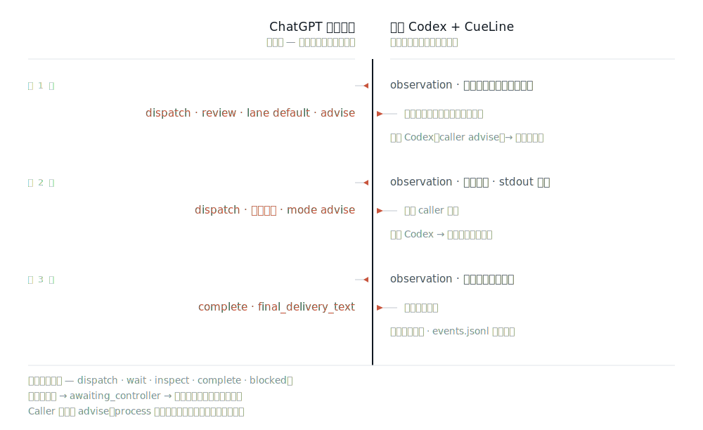

<picture>
  <source media="(prefers-color-scheme: dark)" srcset="docs/assets/cueline-banner-dark.svg">
  
</picture>

<p align="center">
  <a href="https://github.com/Seraphim0916/cueline/actions/workflows/ci.yml"></a>
</p>

<p align="center">
  <a href="README.md">English</a> · <a href="README.zh-TW.md">繁體中文</a> · <b>简体中文</b> · <a href="README.ja.md">日本語</a> · <a href="README.ko.md">한국어</a>
</p>

**CueLine 把方向盘交给一个已经打开的 ChatGPT 网页会话：由它规划整轮运行、发出每一步指令；而 CueLine 负责校验每一条指令，并在你这台机器上把活儿真正干完。**

那个网页碰不到你的机器。它每一轮只输出一小段文本指令。CueLine 判断这条指令格式是否合法、是否属于本次运行、对应到哪个本地 worker——然后才执行它、保留证据，再把证据交回去。

CueLine 是独立实现，**没有任何运行时 npm 依赖**，也不是 Omnilane 或 GPT Relay 的包装层。

## 一次运行实际是怎么走的



每一轮：CueLine 先把“接下来要问什么”写入记录，向会话发送一份观测（observation），再读回**恰好一个** `<CueLineControl>` 信封。控制器从五个动作中选一个——`dispatch`、`wait`、`inspect`、`complete`、`blocked`——信封之外的任何文本都不会被执行。指令若指向错误的 run、错误的轮次，或作业定义有误，会被退回做次数有上限的修复，而不是靠猜。循环停在 `complete` 或 `blocked`，或轮次耗尽（默认 12 轮）。

控制器决定*应该发生什么*；本地这一侧决定*是否允许发生、以何种方式发生*：通道（lane）必须启用、候选必须在任何进程启动**之前**确认可用、`argv[0]` 必须早已由你的路由配置注册。没有任何内容会经过 shell。worker 一旦启动，就不会悄悄退回到第二个候选——失败以证据的形式返回，而不是自动重试。

控制器协议有意区分路由层级：`lane` 填的是通道名称 `default`；`codex-default` 是该通道内的候选执行器，不是通道。CueLine 会在注册任何作业之前先验证整份 `dispatch`；只要包含无效通道或执行器，整份派工就会被退回修复，不会先执行其中一部分。

这是白名单（allow-list），不是沙箱。已注册的 worker 拥有与 CueLine 进程本身相同的权限；`advise` 对应 Codex 的只读沙箱、`work` 对应 `workspace-write`，但你注册了什么，就等于你授权了什么。

## 控制器必须是 Pro 模型

除非输入框的模型选择器显示 `Pro`，否则 CueLine 拒绝发送。会话若停在别的模型，CueLine 会先把输入框切换到 `Pro`——这是它唯一被允许做的模型切换。在一次已验证的实机运行中，它把 Instant 切换为 Pro，返回的响应是 `gpt-5-6-pro`。

选中不等于证明。每次响应之后，CueLine 会读取该条已完成助手消息的模型 slug，并要求它是 Pro 的 slug；发送与回复之间若发生降级，会被抓出来，而不是被信任。失败会以 `MODEL_SELECTOR_MISSING`、`PRO_MODEL_UNAVAILABLE`、`PRO_MODEL_SELECTION_FAILED` 或 `PRO_MODEL_MISMATCH` 暴露出来——绝不会变成一个被接受的答案。

ChatGPT Pro 订阅套餐与“选定的 Pro 模型”是两回事。账号或个人资料标签上出现 `Pro`，只是订阅套餐的证据，永远不算模型证据；只有响应的模型 slug 才算。每一轮实机回合都会持久化 `controller_response_received`，携带 `selected_model_label`、`response_model_slug` 与 `model_evidence_source`，因此“是哪一种证据证明了模型”事后依然可审计。

## 五分钟上手

你需要 Node.js 22 以上、带内置浏览器的 Codex，以及——若使用内置的默认通道——`PATH` 上有 `codex` CLI。

从 npm registry 安装：

```bash
npm install -g cueline@0.1.3
cueline install
cueline doctor
```

作为后备，也可以安装 [v0.1.3 release](https://github.com/Seraphim0916/cueline/releases/tag/v0.1.3) 上的打包 tarball，该 release 同时附带它的 `.sha256` 校验值：

```bash
npm install -g https://github.com/Seraphim0916/cueline/releases/download/v0.1.3/cueline-0.1.3.tgz
cueline install
cueline doctor
```

`cueline install` 只创建一个软链接：把内置的 skill 接到 `$CODEX_HOME/skills/cueline`（默认 `~/.codex/skills/cueline`）。它拒绝覆盖不属于自己的路径，重复执行也不会产生副作用。`cueline uninstall` 只移除那一个链接；若该位置换成了别人的文件，它会保留而不删除。

### 从源码安装

```bash
git clone https://github.com/Seraphim0916/cueline.git
cd cueline
npm ci
npm run build
./install.sh      # 创建 ~/.codex/skills/cueline 与 ~/.local/bin/cueline 两个软链接
cueline doctor
```

`install.sh` 只创建这两个软链接，不做别的；它拒绝覆盖不属于自己的路径，而 `./install.sh --uninstall` 也只移除自己创建的链接。

然后，在 Codex 里：

1. 用 Codex 的内置浏览器打开 `https://chatgpt.com` 并登录。
2. 让你想让它当控制器的那个会话保持选中——该页面就是控制器。它的输入框必须停在 `Pro` 模型；若不是，CueLine 会替你选成 `Pro`，否则就拒绝发送。
3. 让 Codex 用 CueLine 处理任务：*“用 CueLine，让那个打开的 ChatGPT Pro 会话来指挥这项任务。”*
4. 保留返回的 `runId`。被中断的运行要续跑，就靠它。

内置的 `cueline` skill 是从 Codex 自身的 Node runtime 驱动这个包的——内置浏览器对象就存在于那里。另外单独启动的 `node` 进程不会继承它。

## 从代码驱动

```js
import { createCodexIabAdapter, runCueLine } from "cueline";

const result = await runCueLine({
  request: "Inspect the repository, delegate an implementation plan, and report the evidence.",
  browser: createCodexIabAdapter(),
  // 可选：conversationUrl、routingConfig / routingConfigPath、home、cwd、
  // runTimeoutMs、signal，以及作业/默认期限。
});

if (result.status === "complete") {
  console.log(result.finalDeliveryText);
}
```

在 Codex 的 runtime 里，import `cueline api path` 打印出的那个绝对路径模块——那就是你安装的那份包构建出来的 API。

`startCueLineRun` 是显式的启动入口（`runCueLine` 是它的别名）。`continueCueLineRun({ runId })` 会在同一个会话中续跑被中断的运行，并复用已保存的会话链接，除非你传入新的 adapter。`loadCueLineRunState(runId)` 只读取已持久化的状态，不驱动任何东西。已经到达 `complete`、`blocked` 或 `cancelled` 的运行会原样返回，绝不会被再次派发。续跑前先执行 `cueline run status <run-id> --json`；已接受回复且 phase 为 `jobs_running` 表示 ChatGPT 已回复，本地作业正在执行。

## CLI

CLI 不驱动浏览器。它负责管理 skill 链接，并告诉你本地这一半是否健康。

```console
$ cueline install
CueLine skill installed: /Users/you/.codex/skills/cueline

$ cueline doctor
CueLine 0.1.3
status	ok
node	22.14.0	ok
config	/usr/local/lib/node_modules/cueline/config/routing.default.json	valid
home	/Users/you/.cueline
available_lanes	1

$ cueline api path
/usr/local/lib/node_modules/cueline/dist/src/api.js

$ cueline routing
default	codex-default	available

$ cueline jobs
No jobs.

$ cueline run status run_... --json
{"status":"running","phase":"jobs_running","runtime":{"ownership":"active"},...}

$ cueline run cancel run_...
run_...	requested	affected_jobs=0

$ cueline config path
/usr/local/lib/node_modules/cueline/config/routing.default.json

$ cueline uninstall
CueLine skill removed: /Users/you/.codex/skills/cueline
```

当 Node 版本过旧、或没有任何通道可解析时，`cueline doctor` 会以非零状态退出，因此可直接用作预检。`cueline routing` 会说明某个通道为何不可用，而不是悄悄改选别的。`cueline api path` 打印的就是 skill 会 import 的模块，所以使用打包安装时完全不需要 clone 源码。`cueline help` 会列出全部。

## 配置

`CUELINE_CONFIG` 用于指定路由配置文件；`CUELINE_HOME` 用于迁移本地状态（默认 `~/.cueline`）。

内置的 `default` 通道只有一个候选 `codex-default`：通过 stdin 传入任务运行 `codex exec`，`advise` 用 `read-only`、`work` 用 `workspace-write`。要注册别的 worker，复制一份 [`config/routing.default.json`](config/routing.default.json)、加入你的候选，再把 `CUELINE_CONFIG` 指过去——`argv[0]` 中的可执行文件正是通过这个动作被注册的，并且它也必须在 `PATH` 上，通道才能解析成功。

状态位于 `CUELINE_HOME` 之下：

```text
runs/<run-id>/events.jsonl    仅追加、具权威性
runs/<run-id>/runtime.json   活跃 owner 的 heartbeat 证据
runs/<run-id>/cancel.json    存在时表示持久取消请求
runs/<run-id>/snapshot.json   重放优化产物，可丢弃
jobs/<job-id>.json            每个作业的执行证据
```

事件日志才是记录本身：控制器这一轮在发送之前先写入、作业在进程启动之前先注册，因此“意图”与“副作用”之间若被中断，会留下痕迹。损坏的快照会被忽略并从第 1 号事件重建，而不是被信任。

续跑只会重新接回该次运行记录下来的那个会话 URL，绝不接到长得像的标签页。对仍待处理的控制器回合，它会先在该会话中查找与确切请求对应的已完成回复；找到后以只读方式接回，而不是重发。若旧状态中同时有多个待处理回合，调用方必须明确选择一个。只有当唯一待处理提示能被证明为 `definitely_not_sent` 时，CueLine 才会自动重试；提交状态不明或标签页消失时，它会抛出 `TAB_RECOVERY_UNSAFE` 并停下。

## 验证

```bash
npm ci
npm run typecheck
npm test
npm run smoke:fake
bash test/shell/install.test.sh
npm pack --dry-run
```

`npm run smoke:fake` 用假的浏览器与假的 runner，离线跑完整个控制循环。它证明的是循环，而不是线上页面——只有通过内置浏览器真正完成一轮，才能证明后者。

## 0.1 的限制

仅支持纯文本。一次运行只对应一个会话。选成 `Pro` 是 CueLine 唯一会做的模型切换；不支持图片、不支持文件上传，也不支持 Deep Research、Projects 或 Apps。worker 一旦启动便没有自动重试或回退——失败的 `work` 作业会在副作用被标记为不确定后回报，因为 CueLine 无法证明它执行到了哪一步。macOS 是主要的桌面目标、Linux 是 CI 目标；Windows 未经验证，且 `install.sh` 不是 Windows 安装程序。adapter 依赖 ChatGPT 网页当前的界面，因此界面变更会以明确的 `COMPOSER_MISSING`、`SEND_BUTTON_MISSING` 或响应超时暴露出来——绝不会变成编造的答案。

完整矩阵见 [compatibility](docs/compatibility.md)。

## 文档

[architecture](docs/architecture.md) · [controller protocol](docs/controller-protocol.md) · [runner contract](docs/runner-contract.md) · [state and recovery](docs/state-and-recovery.md) · [compatibility](docs/compatibility.md) · [provenance](docs/provenance.md)（均为英文）

## 开发

TypeScript、ESM，仅使用 Node 内置模块。`npm run build` 编译到 `dist/`；测试以 `node --test` 运行编译产物。CI 覆盖 Ubuntu 与 macOS 上的 Node 22 与 24。

CueLine 是独立项目，与 OpenAI 或任何其他公司均无隶属关系，也未获其背书或赞助。见 [provenance](docs/provenance.md) 与 [third-party notices](THIRD_PARTY_NOTICES.md)。

## 许可证

MIT。见 [LICENSE](LICENSE)。
