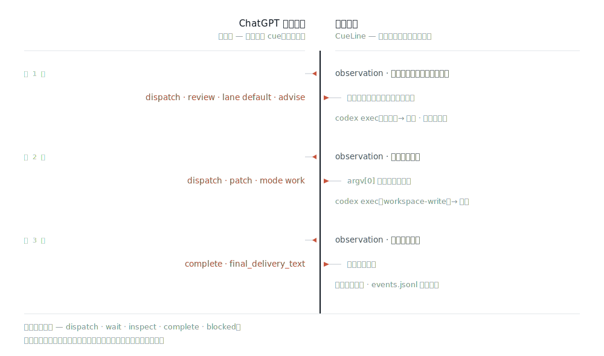

<picture>
  <source media="(prefers-color-scheme: dark)" srcset="docs/assets/cueline-banner-dark.svg">
  
</picture>

<p align="center">
  <a href="https://github.com/Seraphim0916/cueline/actions/workflows/ci.yml"></a>
</p>

<p align="center">
  <a href="README.md">English</a> · <b>繁體中文</b> · <a href="README.zh-CN.md">简体中文</a> · <a href="README.ja.md">日本語</a> · <a href="README.ko.md">한국어</a>
</p>

**CueLine 把方向盤交給一個已經開著的 ChatGPT 網頁對話：由它規劃整趟執行、喊出每一步；而 CueLine 負責檢查每一道指令，並在你這台機器上把事情真的做完。**

那個網頁碰不到你的機器。它每一輪只吐出一小段文字指令。CueLine 判斷這道指令格式對不對、屬不屬於這次執行、對應到哪個本機工作行程（worker）——然後才執行它、保留證據，再把證據交回去。

CueLine 是獨立實作，**沒有任何 runtime npm 相依套件**，也不是 Omnilane 或 GPT Relay 的包裝層。

## 一次執行實際上怎麼跑



每一輪：CueLine 先把自己「即將問什麼」寫進紀錄，送出一份觀測（observation）到對話裡，再讀回**恰好一個** `<CueLineControl>` 封包。主控端從五個動作裡挑一個——`dispatch`、`wait`、`inspect`、`complete`、`blocked`——封包以外的任何文字都不會被執行。指令若寫錯 run、寫錯輪次，或工作定義有問題，會被退回去做有次數上限的修正，而不是靠猜。迴圈停在 `complete` 或 `blocked`，或是輪數用完（預設 12 輪）。

主控端決定*該發生什麼*；本機這一側決定*能不能發生、怎麼發生*：通道（lane）必須啟用、候選項必須在任何程序啟動**之前**就確認可用、`argv[0]` 必須早已由你的路由設定註冊過。沒有任何東西會經過 shell。工作行程一旦啟動，就不會偷偷改用第二個候選項——失敗是以證據的形式回報，不是自動重試。

主控協定刻意區分路由層級：`lane` 填的是通道名稱 `default`；`codex-default` 是該通道內的候選執行器，不是通道。CueLine 會在註冊任何工作前先驗證整份 `dispatch`；只要包含無效通道或執行器，整份派工就會被退回修正，不會先執行其中一部分。

這是允許清單（allow-list），不是沙箱。已註冊的工作行程擁有跟 CueLine 行程本身相同的權限；`advise` 對應 Codex 的唯讀沙箱、`work` 對應 `workspace-write`，但你註冊了什麼，就等於你授權了什麼。

## 主控端必須是 Pro 模型

除非輸入框的模型選單顯示 `Pro`，否則 CueLine 拒絕送出。對話若停在別的模型，CueLine 會先把輸入框切成 `Pro`——這是它唯一被允許做的模型切換。在一次已驗證的實機執行中，它把 Instant 切成 Pro，回應回來的是 `gpt-5-6-pro`。

選了不等於證明了。每次回應之後，CueLine 會讀取該則已完成助理訊息的模型 slug，並要求它是 Pro 的 slug；送出與回覆之間若被降級，會被抓出來，而不是被信任。失敗會以 `MODEL_SELECTOR_MISSING`、`PRO_MODEL_UNAVAILABLE`、`PRO_MODEL_SELECTION_FAILED` 或 `PRO_MODEL_MISMATCH` 浮現——絕不會變成一個被接受的答案。

ChatGPT Pro 訂閱方案與「選定的 Pro 模型」是兩回事。帳號或個人資料標籤上出現 `Pro`，只是訂閱方案的證據，永遠不算模型證據；只有回應的模型 slug 才算。每一輪實機回合都會保存 `controller_response_received`，帶著 `selected_model_label`、`response_model_slug` 與 `model_evidence_source`，因此「是哪一種證據證明了模型」事後仍可稽核。

## 五分鐘上手

你需要 Node.js 22 以上、帶內建瀏覽器的 Codex，以及——若要用內建的預設通道——`PATH` 上有 `codex` CLI。

從 npm registry 安裝：

```bash
npm install -g cueline@0.1.2
cueline install
cueline doctor
```

作為備援，也可以安裝 [v0.1.2 release](https://github.com/Seraphim0916/cueline/releases/tag/v0.1.2) 上的打包 tarball，該 release 同時附上它的 `.sha256` 校驗碼：

```bash
npm install -g https://github.com/Seraphim0916/cueline/releases/download/v0.1.2/cueline-0.1.2.tgz
cueline install
cueline doctor
```

`cueline install` 只建立一個符號連結：把內建的 skill 接到 `$CODEX_HOME/skills/cueline`（預設 `~/.codex/skills/cueline`）。它拒絕覆寫不屬於自己的路徑，重複執行也不會有副作用。`cueline uninstall` 只移除那一個連結；若該位置換成了別人的檔案，它會保留而不刪除。

### 從原始碼安裝

```bash
git clone https://github.com/Seraphim0916/cueline.git
cd cueline
npm ci
npm run build
./install.sh      # 建立 ~/.codex/skills/cueline 與 ~/.local/bin/cueline 兩個符號連結
cueline doctor
```

`install.sh` 只建立那兩個符號連結，不做別的；它拒絕覆寫不屬於自己的路徑，而 `./install.sh --uninstall` 也只移除自己建立的連結。

接著，在 Codex 裡：

1. 用 Codex 的內建瀏覽器開啟 `https://chatgpt.com` 並登入。
2. 讓你要當主控的那個對話保持選取狀態——該頁面就是主控端。它的輸入框必須停在 `Pro` 模型；若不是，CueLine 會替你選成 `Pro`，否則就拒絕送出。
3. 請 Codex 用 CueLine 處理這件事：*「用 CueLine，讓那個開著的 ChatGPT Pro 對話來指揮這項任務。」*
4. 留著回傳的 `runId`。中斷的執行要續跑，就靠它。

內建的 `cueline` skill 是從 Codex 自己的 Node runtime 驅動這個套件的——內建瀏覽器的物件就活在那裡。另外開一個單獨的 `node` 行程並不會繼承它。

## 從程式碼驅動

```js
import { createCodexIabAdapter, runCueLine } from "cueline";

const result = await runCueLine({
  request: "Inspect the repository, delegate an implementation plan, and report the evidence.",
  browser: createCodexIabAdapter(),
  // 選填：conversationUrl、routingConfig / routingConfigPath、home、cwd、limits。
});

if (result.status === "complete") {
  console.log(result.finalDeliveryText);
}
```

在 Codex 的 runtime 裡，import `cueline api path` 印出的那個絕對路徑模組——那就是你安裝的那份套件建置出來的 API。

`startCueLineRun` 是明確的啟動入口（`runCueLine` 是它的別名）。`continueCueLineRun({ runId })` 會在同一個對話裡續跑被中斷的執行，並沿用已保存的對話網址，除非你另外傳入新的 adapter。`loadCueLineRunState(runId)` 只讀取已保存的狀態，不驅動任何東西。已經走到 `complete` 或 `blocked` 的執行會原樣回傳，絕不會被再派工一次。

## CLI

CLI 不驅動瀏覽器。它負責管理 skill 連結，並告訴你本機這一半健不健康。

```console
$ cueline install
CueLine skill installed: /Users/you/.codex/skills/cueline

$ cueline doctor
CueLine 0.1.2
status	ok
node	22.14.0	ok
config	/usr/local/lib/node_modules/cueline/config/routing.default.json	valid
home	/Users/you/.cueline
available_lanes	1

$ cueline api path
/usr/local/lib/node_modules/cueline/dist/src/api.js

$ cueline routing
default	codex-default	available

$ cueline jobs
No jobs.

$ cueline config path
/usr/local/lib/node_modules/cueline/config/routing.default.json

$ cueline uninstall
CueLine skill removed: /Users/you/.codex/skills/cueline
```

Node 版本太舊、或沒有任何通道解析得出來時，`cueline doctor` 會以非零狀態結束，因此可以直接拿來當前置檢查。`cueline routing` 會告訴你某個通道為什麼不可用，而不是安靜地改選別的。`cueline api path` 印出的就是 skill 會 import 的模組，所以用打包安裝時完全不需要 clone 原始碼。`cueline help` 會列出全部。

## 設定

`CUELINE_CONFIG` 用來指定路由設定檔；`CUELINE_HOME` 用來搬動本機狀態（預設 `~/.cueline`）。

內建的 `default` 通道只有一個候選項 `codex-default`：以 stdin 傳入任務執行 `codex exec`，`advise` 用 `read-only`、`work` 用 `workspace-write`。要註冊別的工作行程，複製一份 [`config/routing.default.json`](config/routing.default.json)、加入你的候選項，再把 `CUELINE_CONFIG` 指過去——`argv[0]` 裡的執行檔就是透過這個動作被註冊的，而且它也必須在 `PATH` 上，通道才解析得出來。

狀態放在 `CUELINE_HOME` 底下：

```text
runs/<run-id>/events.jsonl    只追加、具權威性
runs/<run-id>/snapshot.json   重播的最佳化產物，可丟棄
jobs/<job-id>.json            每個工作的執行證據
```

事件日誌才是紀錄本身：主控端的這一輪在送出之前就先寫下、工作在行程啟動之前就先註冊，所以「意圖」與「副作用」之間若被中斷，會留下痕跡。壞掉的快照會被忽略、從第 1 號事件重建，而不是硬信它。

續跑只會重新接回該次執行記錄下來的那個對話網址，絕不接到長得像的分頁。對尚待處理的主控回合，它會先在該對話尋找與確切請求相符的已完成回覆；找到就以唯讀方式接回，不會重送。若舊狀態中同時有多個待處理回合，呼叫端必須明確指定一個。只有當唯一待處理提示能被證明為 `definitely_not_sent` 時，CueLine 才會自動重試；提交狀態不明或分頁消失時，會丟出 `TAB_RECOVERY_UNSAFE` 並停下。

## 驗證

```bash
npm ci
npm run typecheck
npm test
npm run smoke:fake
bash test/shell/install.test.sh
npm pack --dry-run
```

`npm run smoke:fake` 會用假的瀏覽器與假的 runner，離線跑完整個主控迴圈。它證明的是迴圈，不是線上頁面——只有真正透過內建瀏覽器完成一輪，才能證明後者。

## 0.1 的限制

只支援純文字。一次執行只對應一個對話。選成 `Pro` 是 CueLine 唯一會做的模型切換；不支援圖片、不支援檔案上傳，也不支援 Deep Research、Projects 或 Apps。工作行程一旦啟動就沒有自動重試或改道——失敗的 `work` 工作會被標記為副作用不明確後回報，因為 CueLine 無法證明它做到哪裡。macOS 是主要的桌面目標、Linux 是 CI 目標；Windows 未經驗證，而且 `install.sh` 不是 Windows 安裝程式。adapter 依賴 ChatGPT 網頁目前的介面，所以介面一改，會以明確的 `COMPOSER_MISSING`、`SEND_BUTTON_MISSING` 或回應逾時浮現——絕不會變成捏造的答案。

完整矩陣見 [compatibility](docs/compatibility.md)。

## 文件

[architecture](docs/architecture.md) · [controller protocol](docs/controller-protocol.md) · [runner contract](docs/runner-contract.md) · [state and recovery](docs/state-and-recovery.md) · [compatibility](docs/compatibility.md) · [provenance](docs/provenance.md)（皆為英文）

## 開發

TypeScript、ESM，只用 Node 內建模組。`npm run build` 會編譯到 `dist/`；測試以 `node --test` 跑編譯後的產物。CI 涵蓋 Ubuntu 與 macOS 上的 Node 22 與 24。

CueLine 是獨立專案，與 OpenAI 或任何其他公司皆無隸屬關係，亦未獲其背書或贊助。見 [provenance](docs/provenance.md) 與 [third-party notices](THIRD_PARTY_NOTICES.md)。

## 授權

MIT。見 [LICENSE](LICENSE)。
